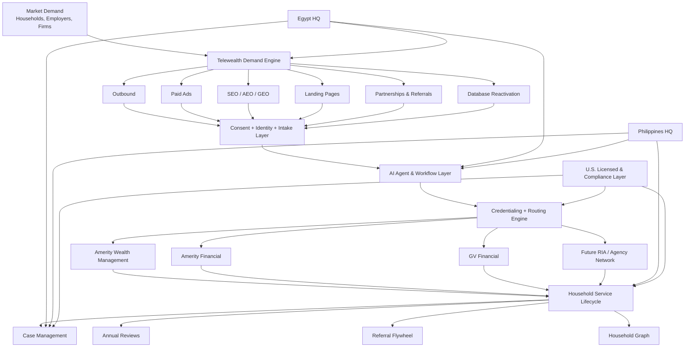
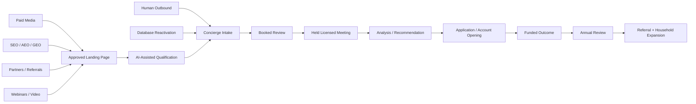
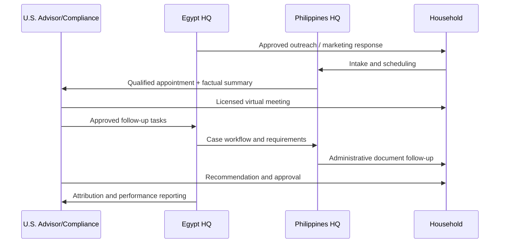
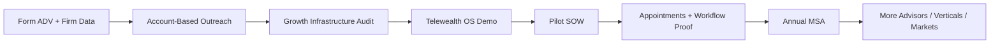
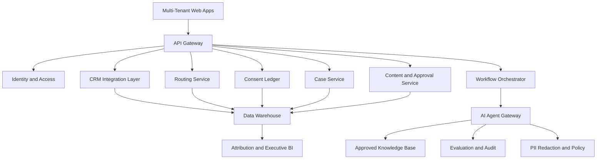

# TELEWEALTH OS
## Nationwide Wealth Distribution, Demand Generation, AI and Operations Infrastructure

**Omnikom LLC × Rainmaker Wealth Innovation LLC**  
**Founding Pilot:** Amerity Wealth Management, Amerity Financial and GV Financial  
**Operating Hubs:** Egypt HQ + Philippines HQ + U.S. licensed delivery network  
**Version:** 1.0  
**Date:** July 2026  
**Status:** Confidential strategic and implementation blueprint

---

## Important Working Assumptions

1. **Amerity** is the correct spelling and refers to Amerity Wealth Management, LLC and Amerity Financial, LLC.
2. **GV Financial** is used throughout this document as the working partner name. Public regulatory records appear to identify **GV Financial Services, Inc.** as an outside business activity associated with Gil Blas Velez, who is also publicly listed in connection with Amerity Wealth Management and Amerity Financial. The exact contracting entity, licensing footprint, carrier appointments and commercial role must be confirmed before launch.
3. This document is a business, technology, marketing and operating blueprint. It is not legal, securities, insurance, tax or compliance advice.
4. All consumer-facing campaigns, scripts, landing pages, AI outputs, compensation structures and provider-routing rules must be approved by the applicable regulated entity and qualified U.S. counsel before deployment.
5. Insurance commissions, advisory fees and referral compensation may only flow through legally permitted, licensed and properly documented arrangements. Omnikom should not assume entitlement to product compensation merely because it generated or serviced an opportunity.

---

# 1. Executive Thesis

Telewealth OS is a proprietary demand-generation, distribution, workflow and operations platform built by Omnikom and commercially expanded with Rainmaker.

It sits between:

- American households and business owners
- Financial advisors and insurance agents
- Registered investment advisers
- Insurance agencies, IMOs and carriers
- Retirement-plan specialists
- Distributors and affinity partners
- Marketing channels
- Global operations teams
- Compliance and licensed supervisory entities

The platform combines two engines that should be designed as one intellectual property system:

1. **The Demand Engine**
   - Human outbound calling
   - Inbound lead response
   - Paid advertising
   - Search engine optimization
   - Answer engine optimization
   - Generative engine optimization
   - Landing-page creation
   - Webinars, video and content
   - Referral and partnership acquisition
   - Database reactivation
   - RIA and advisor business development

2. **The Telewealth Operating Engine**
   - AI agents
   - Consumer intake
   - Consent management
   - Advisor and provider credentialing
   - Rules-based routing
   - Appointment coordination
   - Meeting preparation
   - Case management
   - Document collection
   - Quality assurance
   - Compliance surveillance
   - Revenue attribution
   - Annual-review and referral automation
   - Global workforce execution across Egypt and the Philippines

Amerity Wealth Management, Amerity Financial and GV Financial become the founding pilot environment.

The pilot proves:

- Consumer acquisition economics
- Advisor conversion
- Insurance and advisory workflows
- Remote household servicing
- Compliance controls
- AI-assisted operations
- Cross-border BPO security
- Attribution from first touch to funded outcome
- The ability to replicate the infrastructure across thousands of wealth firms

The long-term company is not a lead seller and should not be positioned as an unlicensed financial-services provider.

> **Telewealth OS is the infrastructure layer that helps regulated financial firms acquire, match, advise, protect and retain households through a secure virtual operating model.**

---

# 2. Strategic Positioning

## 2.1 Category Definition

**Telewealth** is the commercial category.

It should be explained as:

> A remote, advisor-led and technology-enabled model for delivering retirement planning, wealth management, insurance protection and ongoing household financial service.

The analogy to telehealth is operational, not regulatory.

Telehealth connects a patient, an intake system, a credentialed provider, remote consultation, records, fulfillment and follow-up.

Telewealth connects a household, a financial-needs intake, a credentialed financial professional, virtual consultation, secure records, implementation and lifetime reviews.

Telewealth does **not** create a new license or eliminate existing securities and insurance requirements.

## 2.2 Core Market Position

### Consumer Position

> **Financial guidance, protection and retirement support—wherever you are.**

### Wealth-Firm Position

> **The operating system for virtual wealth distribution and household growth.**

### Enterprise Position

> **One infrastructure layer connecting demand, advisors, licensed entities, global operations and AI.**

### Omnikom Position

> **Omnikom owns and operates the demand, technology and workforce infrastructure behind Telewealth.**

### Rainmaker Position

> **Rainmaker accelerates financial-services distribution, strategic relationships and Philippines talent deployment.**

### Founding Pilot Position

> **Amerity Wealth Management, Amerity Financial and GV Financial are the founding regulated pilot partners used to validate the model before national network expansion.**

---

# 3. The Market Opportunity

The addressable provider market is materially larger than “a few thousand firms.”

The Investment Adviser Association reported **16,544 SEC-registered investment advisers in 2025**, serving 73.7 million clients. It also reported that 92.8% employed 100 or fewer employees and 67.4% managed less than $1 billion.[^1]

This fragmentation creates an attractive infrastructure opportunity. Many firms are strong at advice but underbuilt in:

- Demand generation
- Outbound prospecting
- Paid media
- Content operations
- Search visibility
- Lead response
- Appointment setting
- Database reactivation
- Recruiting
- Case processing
- Cross-channel attribution
- AI adoption
- Compliance-aware workflow automation
- Scalable client service

The initial serviceable market should not be every RIA.

## Recommended Initial Firm ICP

Target firms with:

- 1–50 advisors
- Approximately $50 million–$2 billion in AUM
- Individual, retiree, business-owner or plan-sponsor clients
- A virtual or hybrid service capability
- Organic-growth pressure
- Weak or inconsistent internal prospecting
- A meaningful inactive database
- Limited marketing and operations headcount
- Willingness to adopt centralized workflow standards
- A compliance leader willing to supervise the model
- Capacity to accept new clients

A realistic initial serviceable universe is approximately **4,000–7,000 firms**, subject to filtering against Form ADV data, services, client type, AUM, locations and business activities.

The SEC makes current investment-adviser data available through IAPD and downloadable data resources, creating a primary-source foundation for building the provider prospect database.[^2]

---

# 4. Founding Pilot Structure

## 4.1 Amerity Wealth Management

Amerity Wealth Management should serve as the initial regulated advisory anchor.

Its March 2026 Form ADV describes:

- Investment and financial advice
- Asset management
- Financial planning
- Retirement consulting
- Independent advisory representatives
- Advisory representatives who may separately act as licensed insurance agents of Amerity Financial
- Compensated client-referral arrangements where permitted
- Qualified custodians rather than Amerity directly holding ordinary client assets[^3]

Amerity should be described as an **advisory anchor**, not as the custodian or “holder” of all client money.

## 4.2 Amerity Financial

Amerity Financial should serve as the initial insurance and annuity distribution anchor.

Amerity publicly positions itself around retirement savings, income planning, annuities and insurance protection.[^4]

Amerity Wealth’s Form ADV states that Amerity Financial operates as an insurance marketing organization with selling agreements with various insurance companies. It also discloses that insurance commissions typically range from 5% to 10% of the total insurance-product purchase, while emphasizing conflicts, suitability and liquidity considerations.[^3]

This supports an integrated pilot, but product selection and compensation must never drive the matching algorithm ahead of household fit.

## 4.3 GV Financial

GV Financial should be treated as a founding distribution and producer partner, subject to confirmation of:

- Exact legal entity
- Authorized signatory
- Insurance licenses
- Advisor registrations
- Carrier appointments
- States served
- Product authority
- Case ownership
- Revenue rights
- Supervisory structure
- Data rights

Public FINRA records appear to associate Gil Blas Velez with Amerity Wealth Management, Amerity Financial and GV Financial Services, Inc.[^5] This must be verified directly before contracts or public marketing.

## 4.4 Omnikom

Omnikom owns or controls the infrastructure layer:

- Demand-generation IP
- Outbound operating system
- AI-agent orchestration
- Data architecture
- Consent ledger
- Provider-routing logic
- Landing-page factory
- SEO/AEO/GEO systems
- Paid-media operations
- CRM workflow
- QA and reporting
- Egypt operating hub
- Platform engineering
- Multi-tenant replication

## 4.5 Rainmaker

Rainmaker leads or supports:

- Financial-services client acquisition
- Strategic relationship development
- Advisor and agency distribution
- Philippines talent recruitment
- Account development
- White-label partnerships
- Producer and firm onboarding
- Philippines operating capacity

---

# 5. Platform Architecture



---

# 6. The Telewealth IP Stack

The core moat is not a list of leads. It is the connected operating system.

## 6.1 Demand Graph

Tracks:

- Source
- Campaign
- Keyword
- Ad
- Content page
- Outbound list
- Referrer
- Webinar
- Partner
- Creative
- Cost
- Consent status
- Contact attempts
- Conversion path
- Revenue attribution

## 6.2 Household Graph

Tracks the consented household relationship:

- Household members
- Contact preferences
- Life events
- Retirement status
- Broad asset bands
- Business ownership
- Existing advisor relationship
- Financial concerns
- Service history
- Appointments
- Assigned providers
- Policies and accounts only where authorized
- Annual reviews
- Referrals
- Complaints and opt-outs

The Household Graph is not a public lead file. It is a permissioned operational record with role-based access.

## 6.3 Provider Graph

Tracks every regulated provider and professional:

- Legal entity
- CRD/IARD identifiers
- SEC or state registration
- Insurance licenses
- Carrier appointments
- States served
- Services
- Specializations
- Account minimums
- Languages
- Availability
- Capacity
- Response time
- Conversion
- Client satisfaction
- Complaints
- Compliance status
- Data-security status

## 6.4 Consent Ledger

Every outreach or handoff should be supported by an immutable consent record:

- Source
- Consent language
- Date and time
- Channel
- IP/device where applicable
- Calling entity
- Brands disclosed
- Permitted affiliates
- Opt-out history
- Do-not-call status
- Expiration or refresh requirement
- Recording consent where required

## 6.5 Campaign and Content Graph

Stores:

- Approved claims
- Prohibited claims
- Disclosures
- Script versions
- Landing-page versions
- Ad versions
- Content reviewers
- Approval dates
- Expiration dates
- Evidence sources
- Archived public communications

## 6.6 Routing Engine

The routing engine performs service matching, not autonomous financial advice.

### Hard Filters

- State
- Registration
- Insurance license
- Carrier appointment
- Service type
- Account minimum
- Consumer consent
- Existing relationship
- Conflicts
- Capacity
- Firm eligibility

### Soft Scoring

- Specialization
- Language
- Consumer preference
- Speed-to-lead
- Show rate
- Conversion
- Operational accuracy
- Client satisfaction
- Geography
- Availability

The highest-paying provider must not automatically receive priority.

## 6.7 Case OS

Tracks:

- Recommendation stage
- Application
- Account opening
- Transfer
- Underwriting
- Missing documents
- Not-in-good-order items
- Funding
- Policy delivery
- Custodian status
- Carrier status
- Revenue event
- Service follow-up

## 6.8 Compliance OS

Maintains:

- DNC suppression
- Calling-hour control
- Script approval
- Ad approval
- Marketing-rule archive
- Complaint workflows
- Call sampling
- AI-output review
- Access logs
- Retention
- Incident response
- Provider credential expiration
- Employee certifications

---

# 7. Product and Service Verticals

Telewealth should be organized around household needs, not predetermined products.

| Vertical | Consumer or business entry offer | Regulated endpoint | Potential outcomes |
|---|---|---|---|
| Retirement clarity | “Review whether your current retirement strategy still fits your goals.” | IAR / retirement advisor | Planning, AUM, income strategy, no change |
| Old 401(k) options | “Understand the available options for a former employer plan.” | IAR / ERISA-qualified professional | Leave, move to new plan, distribution, IRA rollover |
| Retirement income | “Explore how your current assets may support future income.” | IAR + licensed insurance agent where relevant | Planning, portfolio strategy, annuity where suitable |
| Wealth management | “Receive a second opinion on risk, allocation and planning.” | RIA/IAR | Planning and AUM |
| Mortgage protection | “Review how household obligations would be handled after death or disability.” | Licensed insurance professional | Term, permanent insurance, no action |
| Living benefits | “Review protection against qualifying critical, chronic or terminal events.” | Licensed insurance professional | Approved life-insurance options |
| Family protection | “Evaluate income replacement and beneficiary needs.” | Licensed insurance professional | Life insurance and planning |
| Business-owner planning | “Review personal, business and employee retirement exposure.” | Advisor, plan specialist, insurance professional | 401(k), owner planning, key person, buy-sell |
| Employer retirement plans | “Virtual retirement-plan health check.” | Retirement-plan specialist / RIA | Plan consulting and participant education |
| Estate and legacy coordination | “Organize beneficiaries, legacy goals and professional coordination.” | Advisor + attorney/CPA partners | Planning and referrals |
| Existing-client reactivation | “Schedule a current-plan and beneficiary review.” | Existing firm/advisor | Retention, service, cross-sell where appropriate |
| Orphan-policy service | “Reconnect policyholders with service and review support.” | Licensed agency | Policy service and appropriate review |
| Advisor growth | “Deploy a complete virtual demand and operations engine.” | RIA/agency principal | Platform subscription and managed services |
| Advisor recruiting | “Source, screen and onboard qualified remote and U.S. talent.” | Firm | Recruiting and workforce deployment |

---

# 8. Full Consumer Acquisition Engine

The acquisition strategy must use multiple channels because no single channel should control the business.



## 8.1 Channel Portfolio

Recommended steady-state channel mix:

- 25%–35% human outbound and database reactivation
- 20%–30% paid search
- 10%–20% paid social and video
- 15%–25% SEO/AEO/GEO organic
- 10%–20% partnerships, employers and referrals
- 5%–10% webinars, events and direct-response content

These are portfolio design targets, not universal benchmarks.

---

# 9. Outbound Engine

Outbound remains a core proprietary advantage and should be integrated with digital demand generation.

## 9.1 Consumer Outbound

### Appropriate Uses

- Consented follow-up
- Existing-client service outreach
- Database reactivation
- Event and webinar follow-up
- Referral outreach where permitted
- Policy and annual-review scheduling
- Lawfully sourced cold outreach after DNC and state-law controls
- No-show recovery
- Document follow-up

### Required Controls

- National DNC suppression
- Firm-specific DNC suppression
- State-specific rules
- Local calling hours
- Accurate caller identity
- Script versioning
- Real-time opt-out
- Call recording controls
- Abandonment controls
- No AI-generated cold-call voice
- Supervisor sampling
- Complaint escalation

FINRA Rule 3230 includes telemarketing and firm-specific DNC requirements for applicable member firms.[^6] The FTC Telemarketing Sales Rule imposes disclosure, misrepresentation, calling-time and opt-out requirements for covered activity.[^7] The FCC has confirmed that AI-generated voices fall within TCPA restrictions on artificial or prerecorded voices.[^8]

## 9.2 B2B Outbound

Target:

- RIA founders
- Chief growth officers
- Insurance agency owners
- IMOs
- Retirement-plan consultants
- Banks and credit unions
- CPAs
- PEOs and payroll firms
- Mortgage companies
- Employer-benefits firms
- Advisor networks
- Carriers

B2B sequences can combine:

- Email
- LinkedIn
- Human calls
- Executive letters
- Webinars
- Case studies
- ROI assessments
- Pilot offers

B2B calling may receive different treatment under certain telemarketing rules, but legal review is still required for each use case and jurisdiction.

## 9.3 Outbound Pod Design

### Pilot Pod

- 8 outbound representatives
- 2 Telewealth concierges
- 1 team leader
- 1 QA specialist
- 1 data/campaign manager
- 1 case coordinator
- Licensed-advisor capacity supplied by pilot partners

### Workflow

1. Data enters campaign.
2. Consent/DNC engine checks eligibility.
3. AI prepares call context.
4. Human caller places call.
5. AI assists with script navigation and notes.
6. Caller records factual disposition.
7. Qualified consumer moves to concierge.
8. Concierge confirms service need and consent.
9. Routing engine assigns eligible provider.
10. Automated reminders and disclosures are sent.
11. Licensed professional conducts the meeting.

## 9.4 Outbound Base-Case Funnel

Illustrative monthly planning model:

| Stage | Base assumption |
|---|---:|
| Dials | 25,000 |
| Live conversations | 2,500 |
| Qualified households | 300 |
| Meetings booked | 165 |
| Meetings held | 116 |
| Applications or implementations | 35 |
| Funded outcomes | 28 |

This assumes:

- 10% live-connect rate
- 12% qualification from live conversations
- 55% booking from qualified households
- 70% show rate
- 30% application/implementation rate from held meetings
- 80% funding/placement rate

These are internal planning assumptions that must be replaced with actual pilot data.

---

# 10. Paid Advertising Engine

Paid media should be controlled by Telewealth OS but run under the legally correct advertiser and approved regulated brand.

## 10.1 Google Search

Priority campaign families:

1. **High-intent retirement review**
2. **Financial advisor second opinion**
3. **Old 401(k) options**
4. **Retirement income planning**
5. **Life-insurance review**
6. **Mortgage-protection review**
7. **Business-owner retirement planning**
8. **401(k) plan consultant**
9. **Brand protection**
10. **RIA growth platform** for B2B acquisition

### Search Best Practices

- Separate each intent into its own campaign and landing page.
- Import offline conversion stages, not just lead submissions.
- Optimize toward held qualified meetings and funded outcomes.
- Use negative-keyword governance.
- Avoid promises, guaranteed outcomes and misleading tax claims.
- Match ad entity, landing-page entity and licensed provider.
- Disclose who provides advisory or insurance services.
- Maintain evidence for every quantitative claim.
- Do not upload sensitive account or health information to ad platforms.
- Use first-party IDs and privacy-reviewed conversion APIs.

Google maintains specific financial-products and services advertising policies and may require verification depending on advertiser type, product and region.[^9]

## 10.2 Meta

Recommended uses:

- Educational video
- Retirement concerns
- Business-owner education
- Webinar registration
- Existing-site retargeting where legally appropriate
- Brand awareness
- Lead forms with compliant consent
- Advisor recruiting
- RIA B2B demand

Meta requires financial and insurance promotions to follow its financial-services policies, and U.S. financial-product campaigns may fall under the Financial Products and Services Special Ad Category with targeting restrictions.[^10]

### Meta Guardrails

- Target adults only.
- Avoid implying personal financial status.
- Avoid copy such as “You are broke,” “You have no retirement plan,” or “Your mortgage is unprotected.”
- Do not exploit financial distress.
- Do not use sensitive custom audiences derived from account balances, debt, health conditions or hardship.
- Use broad, contextual, geographic and engagement-based targeting where permitted.
- Route to educational review offers rather than hard product pitches.

## 10.3 YouTube and Connected Video

Use for:

- Founder authority
- Retirement education
- Product-neutral explainer videos
- Advisor introductions
- Webinar clips
- Case-process explanations
- Objection handling
- Business-owner education

Every video should have:

- A defined audience
- One approved claim set
- Captions
- A compliance-approved CTA
- A matching landing page
- Source links
- A last-reviewed date

## 10.4 LinkedIn

Primary B2B use cases:

- Recruit wealth firms to Telewealth OS
- Recruit advisors and agents
- Reach plan sponsors and business owners
- Promote executive webinars
- ABM toward selected RIAs
- Distribute case studies
- Build partner channels

## 10.5 Paid-Media Planning Model

Illustrative $60,000 monthly paid-media budget:

| Category | Budget |
|---|---:|
| Google Search | $30,000 |
| Meta | $12,000 |
| YouTube | $6,000 |
| LinkedIn B2B | $8,000 |
| Creative testing and contingency | $4,000 |

Illustrative base-case funnel:

| Stage | Base assumption |
|---|---:|
| Ad spend | $60,000 |
| Blended lead cost | $175 |
| Leads | 343 |
| Qualified | 154 |
| Booked | 92 |
| Held | 64 |
| Applications/implementations | 19 |
| Funded outcomes | 15 |

This is a planning model, not a market guarantee. The platform should pause any channel that cannot produce acceptable economics at the **held-meeting and funded-outcome** levels.

---

# 11. SEO, AEO and GEO Engine

SEO, AEO and GEO should be one integrated authority-building system.

Google’s current guidance states that foundational SEO continues to apply to generative AI search, and it cautions against treating AEO or GEO as a collection of hacks. Google emphasizes valuable, original, crawlable, people-first content and clear technical structure.[^11]

## 11.1 SEO Foundation

### Technical

- Fast server-rendered pages
- Crawlable internal links
- XML sitemaps
- Canonicals
- Correct robots directives
- Clean URL structure
- Core Web Vitals monitoring
- Mobile-first design
- Accessible forms
- No critical content hidden behind scripts
- Search Console and Bing Webmaster Tools
- IndexNow for timely Bing discovery
- Structured data matching visible content
- Content and redirect governance

### Entity Structure

Create consistent entity pages for:

- Omnikom
- Rainmaker
- Telewealth OS
- Amerity Wealth Management
- Amerity Financial
- GV Financial
- Advisors
- Licensed agents
- Authors
- Reviewers
- Locations
- Services

Use appropriate structured data such as:

- Organization
- FinancialService
- ProfessionalService
- Person
- Service
- Article
- BreadcrumbList
- VideoObject
- FAQPage where appropriate
- LocalBusiness where applicable

Structured data helps search systems understand page meaning but does not guarantee rankings or AI citations.[^12]

## 11.2 Content Architecture

### Pillar 1: Retirement

- Retirement readiness
- Retirement-income planning
- Market-risk education
- Longevity
- Social Security coordination
- Withdrawal planning
- Required minimum distributions
- Retirement checklists

### Pillar 2: 401(k) and Employer Plans

- Old 401(k) options
- Rollover considerations
- Plan-sponsor education
- Participant education
- Business-owner plan design
- Fiduciary considerations
- Employee engagement

### Pillar 3: Insurance and Protection

- Life insurance basics
- Mortgage protection
- Living benefits
- Income replacement
- Beneficiary planning
- Key-person insurance
- Buy-sell funding
- Annuity education

### Pillar 4: Wealth Management

- Financial planning
- Portfolio risk
- Diversification
- Advisor selection
- Fee education
- Tax-professional coordination
- Estate-professional coordination

### Pillar 5: Telewealth

- What is Telewealth?
- Virtual financial planning
- How remote reviews work
- Security and privacy
- Advisor credentialing
- How matching works
- Human advisor versus robo-advice
- Telewealth for RIAs

### Pillar 6: Advisor Growth

- RIA lead generation
- Database reactivation
- Wealth-management outbound
- AI for advisors
- Virtual assistants for RIAs
- Case-management outsourcing
- Financial-services BPO
- Advisor recruiting

## 11.3 AEO Best Practices

Each priority page should include:

- A direct two- to three-sentence answer near the top
- Clear definitions
- Decision trees
- Comparison tables
- FAQs
- Examples
- Assumptions
- Original commentary
- Licensed reviewer
- Sources
- Last reviewed date
- Clear next step

Examples of answer-led titles:

- What are the options for an old 401(k)?
- What is a retirement-income review?
- What does a fixed indexed annuity do?
- How does mortgage-protection insurance work?
- What is Telewealth?
- How can an RIA build a virtual growth department?

## 11.4 GEO Best Practices

To increase the probability of being surfaced and cited by generative search systems:

- Publish original, specific and expert-reviewed material.
- Maintain clear authorship and reviewer identity.
- Cite primary sources.
- Keep entity names and business descriptions consistent.
- Make key facts available in HTML, not only images or PDFs.
- Use descriptive headings and tables.
- Publish transparent methodologies for calculators and studies.
- Build original anonymized industry benchmarks after sufficient data exists.
- Allow legitimate search crawlers.
- Monitor AI-search referral traffic.
- Correct outdated pages quickly.
- Avoid fabricated statistics and mass-produced generic content.

OpenAI states that sites should allow **OAI-SearchBot** if they want content surfaced in ChatGPT search, and ChatGPT referral URLs can include `utm_source=chatgpt.com` for measurement.[^13]

An `llms.txt` file may be maintained if useful for other systems, but Google states that it does not use such a file for Search or its generative AI features.[^11]

## 11.5 Financial Content Governance

No AI-generated financial article should publish automatically.

Required workflow:

1. AI produces research brief.
2. Writer creates draft.
3. Source agent validates primary sources.
4. Licensed subject-matter reviewer checks accuracy.
5. Compliance approves claims and CTA.
6. Editor approves clarity.
7. Page publishes with reviewer and date.
8. Monitoring agent checks for stale facts.
9. Material changes trigger re-review.

---

# 12. Landing-Page Factory

Telewealth OS should include a multi-tenant landing-page generation and experimentation system.

## 12.1 Core Templates

1. Retirement Clarity Review
2. Old 401(k) Options Review
3. Retirement Income Review
4. Annuity Education and Review
5. Family Protection Review
6. Mortgage Protection Review
7. Living Benefits Review
8. Business Owner Retirement Review
9. Employer 401(k) Plan Health Check
10. Wealth Management Second Opinion
11. Advisor Recruitment
12. RIA Growth Infrastructure Demo
13. Database Reactivation
14. Webinar Registration
15. Annual Review Scheduling

## 12.2 Page Structure

```text
1. Approved entity and disclosure header
2. Clear, product-neutral headline
3. Specific consumer or firm problem
4. What the review includes
5. Who the service is for
6. How the virtual process works
7. Advisor or firm trust section
8. Educational proof and source material
9. Qualification form
10. Consent and privacy disclosure
11. Scheduling
12. FAQ
13. Legal and regulatory disclosures
14. Firm Form CRS / ADV / licensing links where applicable
```

## 12.3 Dynamic Personalization

Permitted personalization may include:

- State
- Time zone
- Referral source
- Firm
- Advisor
- Service interest
- Webinar attended
- Language
- Device
- Existing-client status

Do not dynamically personalize public pages using sensitive account balances, health conditions, hardship or other restricted data.

## 12.4 Testing Framework

Test:

- Offer
- Headline
- Review format
- Advisor introduction
- Form length
- Calendar placement
- Social proof
- Video
- FAQ order
- CTA wording
- Trust disclosures

Optimize toward:

- Qualified meeting booked
- Meeting held
- Provider accepted
- Case implemented
- Revenue realized
- Complaint-free experience

Do not optimize only toward cheap form submissions.

---

# 13. AI Agent Architecture

AI agents should automate administration and decision support while preserving licensed human control.

FINRA has stated that using AI does not remove existing securities-law and supervisory obligations, and its guidance highlights supervision, communications, recordkeeping and model reliability.[^14] NIST’s AI Risk Management Framework organizes AI governance around **Govern, Map, Measure and Manage**.[^15]

## 13.1 Autonomy Levels

| Level | Description | Telewealth rule |
|---|---|---|
| L0 | Manual | Human performs task |
| L1 | Assist | AI suggests; human decides |
| L2 | Draft and approve | AI creates draft; authorized human approves |
| L3 | Controlled execution | AI executes low-risk administrative actions within rules |
| L4 | Autonomous regulated decision | Not permitted for advice, recommendation or suitability |

## 13.2 Demand and Marketing Agents

### Market Intelligence Agent

- Monitors search demand
- Identifies content gaps
- Tracks competitor messaging
- Maps firm ICPs
- Produces campaign briefs

### Audience and List Agent

- Segments lawful datasets
- Deduplicates records
- Applies source metadata
- Flags missing consent
- Prepares B2B account lists

### Paid Ads Agent

- Drafts campaigns
- Manages negative keywords
- Detects spend anomalies
- Recommends budget shifts
- Builds creative variants
- Never publishes regulated claims without approval

### Creative Agent

- Produces ad concepts
- Video scripts
- Email concepts
- Social posts
- Compliance disclosure placeholders

### SEO Agent

- Creates briefs
- Maps internal links
- Tracks technical issues
- Monitors ranking and crawl changes
- Identifies decaying content

### AEO/GEO Agent

- Generates answer-first outlines
- Checks entity consistency
- Finds missing primary citations
- Monitors AI-search referrals
- Produces citation-ready summaries

### Landing-Page Agent

- Selects approved template
- Inserts approved claims
- Adapts entity and state disclosures
- Creates variants
- Sends page for compliance approval

## 13.3 Outbound and Intake Agents

### Compliance Preflight Agent

- Checks DNC
- Checks local time
- Checks consent
- Checks entity
- Checks campaign
- Checks script
- Blocks ineligible records

### Caller Copilot

- Displays approved opener
- Suggests factual questions
- Warns against prohibited product language
- Creates notes
- Classifies disposition

### Inbound Response Agent

- Responds immediately by approved channel
- Answers process questions
- Collects basic factual intake
- Schedules a human or licensed meeting
- Escalates regulated questions

### Qualification Agent

- Classifies service need
- Confirms state
- Captures broad eligibility
- Does not assess suitability
- Does not recommend a product

### Appointment Agent

- Finds available qualified provider
- Schedules
- Sends disclosures
- Handles reminders
- Reschedules
- Recovers no-shows

## 13.4 Provider and Advisor Agents

### Credentialing Agent

- Monitors Form ADV
- Stores CRD/IARD IDs
- Tracks state registration
- Tracks insurance licenses
- Tracks carrier appointments
- Flags expiration and changes

### Routing Agent

- Applies hard filters
- Scores service fit
- Checks capacity
- Assigns one primary provider
- Creates auditable reason code

### Advisor Preparation Agent

- Summarizes factual intake
- Builds meeting agenda
- Identifies missing documents
- Highlights disclosures required
- Does not propose final advice

### Meeting Scribe

- Transcribes with consent
- Summarizes
- Extracts action items
- Updates CRM drafts
- Flags potential compliance language
- Requires advisor approval

## 13.5 Case and Client-Service Agents

### Case Intake Agent

- Creates case
- Validates required fields
- Requests missing documents
- Routes to correct team

### Application Agent

- Prepares administrative fields
- Coordinates e-signature
- Tracks submission
- Does not make suitability decisions

### NIGO Agent

- Detects not-in-good-order issues
- Contacts assigned team
- Tracks correction
- Escalates aging cases

### Underwriting Agent

- Tracks requirements
- Sends reminders
- Updates status
- Protects sensitive information

### Funding Agent

- Tracks transfer and premium status
- Reconciles records
- Notifies advisor and operations

### Annual Review Agent

- Identifies review date
- Sends approved invitations
- Prepares household summary
- Captures life-event changes
- Routes regulated discussion to advisor

### Referral Agent

- Requests referrals after approved service milestones
- Tracks source
- Preserves disclosures
- Avoids compensated endorsement issues unless approved

## 13.6 Governance and Finance Agents

### QA Agent

- Scores calls
- Detects script deviations
- Flags prohibited claims
- Samples records
- Generates coaching tasks

### Compliance Surveillance Agent

- Monitors public content
- Checks disclosures
- Flags performance claims
- Detects unapproved testimonials
- Tracks complaints
- Produces audit evidence

### Revenue Reconciliation Agent

- Matches source, appointment, case, carrier/custodian status and payment
- Separates gross product economics from platform revenue
- Calculates partner allocations only from approved contracts

### Workforce Agent

- Forecasts staffing
- Tracks attendance
- Schedules teams
- Identifies training needs
- Monitors capacity by hub

## 13.7 AI Controls

Every agent requires:

- Named owner
- Approved purpose
- Allowed data
- Prohibited data
- Approved tools
- Human approval points
- Logging
- Version control
- Evaluation set
- Error threshold
- Rollback
- Incident escalation
- Decommissioning process

The platform must not market AI capabilities that do not exist. The SEC has taken enforcement action against investment advisers for false or misleading claims about AI use.[^16]

---

# 14. Egypt and Philippines Operating Model

## 14.1 Egypt HQ

Recommended ownership:

- Platform product management
- AI engineering
- Workflow automation
- Data operations
- Outbound operations
- QA
- Paid media operations
- Landing pages
- SEO/AEO/GEO
- Analytics
- Reporting
- Knowledge management
- Technical support
- Compliance operations support

## 14.2 Philippines HQ

Recommended ownership:

- Financial-services talent recruitment
- Telewealth concierge teams
- Inbound response
- Appointment coordination
- Client success
- Case processing
- Document follow-up
- Underwriting follow-up
- Advisor support
- Extended-hour coverage
- Partner onboarding
- Workforce continuity

## 14.3 U.S. Licensed Layer

Must retain:

- Investment advice
- Product recommendations
- Rollover analysis
- Insurance suitability
- Advisor supervision
- Agent supervision
- Final client communications requiring licensure
- Account-opening authorization
- Recommendation approval
- Compliance approval
- Complaint resolution
- Regulatory books and records

## 14.4 Follow-the-Sun Workflow



## 14.5 Security Requirements

Because global teams may handle nonpublic personal information, the operating model should be treated as financial-data infrastructure, not ordinary VA work.

Required controls:

- U.S.-hosted encrypted systems
- Multifactor authentication
- Role-based access
- Least privilege
- Managed devices
- Virtual desktop where appropriate
- No local downloads
- Data-loss prevention
- Audit logs
- Background screening
- Confidentiality agreements
- Screen and session controls
- Secure termination
- Incident-response plan
- Business continuity
- Vendor due diligence
- Periodic access reviews
- Secure call recording
- Data-retention policy
- Cross-border data-processing agreements

The SEC’s amended Regulation S-P strengthened safeguards, service-provider oversight, incident-response and customer-notification requirements for covered institutions.[^17]

---

# 15. Distribution Strategy

Telewealth requires three distribution systems.

## 15.1 Household Distribution

Channels:

- Search
- Social
- Video
- Human outbound
- Referral
- Employers
- Webinars
- Advisors’ inactive databases
- Existing client books
- Affinity groups
- Mortgage and real-estate partners
- CPAs and attorneys
- Direct mail
- Community events

## 15.2 Provider Distribution

Acquire firms through:

- SEC Form ADV account mapping
- RIA founder outbound
- LinkedIn ABM
- Executive webinars
- Case studies
- “growth infrastructure audit”
- Database-reactivation pilot
- White-label landing-page pilot
- Advisor recruiting
- Referral from compliance consultants
- Custodian and technology partnerships
- IMO and carrier relationships

## 15.3 Embedded Distribution

Long-term embedded partners:

- Payroll providers
- PEOs
- Benefits platforms
- Banks
- Credit unions
- Mortgage lenders
- Real-estate brokerages
- Accounting platforms
- Employer associations
- Professional associations
- Alumni groups
- Franchise systems
- Membership organizations

Embedded partners do not provide advice unless licensed. They introduce the Telewealth experience and route consented consumers to regulated providers.

---

# 16. B2B Funnel for Thousands of Wealth Firms

## 16.1 Firm Acquisition Offer

Do not lead with “buy leads.”

Lead with:

> **Install a complete virtual growth and operations department around your firm.**

## 16.2 Entry Offers

1. Wealth Growth Infrastructure Audit
2. Database Reactivation Pilot
3. 30-Day Telewealth Concierge Pilot
4. AI Workflow Assessment
5. Landing-Page and Paid-Search Pilot
6. SEO/AEO/GEO Authority Assessment
7. Advisor Capacity and Routing Assessment
8. Case-Operations Assessment

## 16.3 B2B Funnel



## 16.4 Illustrative Monthly Firm Funnel After Product-Market Fit

| Stage | Planning target |
|---|---:|
| Target firms researched | 2,000 |
| Decision-makers contacted | 600 |
| Engaged accounts | 120 |
| Discovery meetings | 50 |
| Platform demonstrations | 30 |
| Pilot proposals | 15 |
| New firms signed | 6 |

This is an internal target, not an industry benchmark.

## 16.5 Land-and-Expand Motion

Start with one painful function:

- Reactivation
- Appointment setting
- Paid search
- Landing pages
- Case management
- Annual reviews

Then expand into:

- Full outbound
- SEO/AEO/GEO
- More advisors
- More product verticals
- Recruiting
- AI agents
- Client service
- Enterprise data and analytics

---

# 17. Commercial Packaging

## 17.1 External Wealth-Firm Pricing

### Launch

**$7,500 setup + $4,500/month**

Includes:

- Core CRM workflow
- One landing page
- Basic inbound AI agent
- Appointment automation
- Basic reporting
- One advisor profile
- Limited campaign support

### Growth

**$15,000 setup + $12,500/month**

Includes:

- Multi-channel funnel
- Outbound pod allocation
- Paid-media operations
- Three landing pages
- SEO/AEO/GEO content program
- Telewealth concierge
- AI agents
- QA
- Case workflow
- Up to five advisor profiles

Ad spend and data are separate.

### Enterprise

**$50,000–$150,000 implementation + $35,000–$100,000/month**

Includes:

- Multi-tenant configuration
- Multiple offices
- Provider routing
- Custom integrations
- Dedicated operations pod
- Enterprise analytics
- Security review
- Custom AI agents
- White labeling
- SLA
- Executive governance

## 17.2 Modular Pricing

| Module | Recommended commercial range |
|---|---:|
| Landing-page/funnel build | $5,000–$25,000 one-time |
| SEO/AEO/GEO | $3,500–$15,000/month |
| Paid-media management | 12%–18% of spend, subject to minimum |
| Outbound growth pod | $7,500–$25,000/month |
| Advisor AI seat | $300–$750/month |
| Specialized AI agent | $500–$3,000/month plus usage |
| Case management | $150–$500/case |
| Recruiting and deployment | Custom role or seat pricing |
| Enterprise data/API | Custom |
| Advisor/provider onboarding | $1,000–$5,000/entity |

## 17.3 Product Compensation

Keep these economics separate:

1. **Gross insurance compensation**
2. **Licensed-agent payout**
3. **Agency/IMO override**
4. **Carrier bonuses**
5. **Advisory fees**
6. **Promoter/referral compensation**
7. **Telewealth technology and service revenue**

Do not mix product commissions with Omnikom invoices unless Omnikom becomes legally entitled and the arrangement is approved.

The SEC Marketing Rule imposes disclosure, oversight and disqualification requirements for compensated testimonials and endorsements, including promoters.[^18]

---

# 18. Pilot Financial Model

## 18.1 Monthly Fixed Operating Cost

Illustrative pilot configuration:

| Cost category | Monthly model |
|---|---:|
| 8 outbound representatives | $6,400 |
| 4 concierges/client-success staff | $4,800 |
| 2 case-operations staff | $2,400 |
| QA and team leadership | $3,500 |
| Philippines recruiting/operations | $4,000 |
| Egypt AI and engineering | $12,000 |
| Growth, content, SEO and creative | $8,000 |
| Data, telephony, CRM and cloud | $12,000 |
| Compliance, legal and security | $10,000 |
| U.S. partner/advisor support | $8,000 |
| Management and administration | $8,000 |
| **Total fixed operating cost** | **$79,100** |

## 18.2 Cash Requirement by Paid-Media Level

| Scenario | Fixed cost | Ad spend | Monthly cash requirement |
|---|---:|---:|---:|
| Lean | $79,100 | $30,000 | $109,100 |
| Base | $79,100 | $60,000 | $139,100 |
| Scale | $79,100 | $100,000 | $179,100 |

This excludes extraordinary legal work, major software implementation, carrier fees, advisor compensation and taxes.

## 18.3 Illustrative Insurance Production Economics

At an illustrative 7% gross commission:

| Scenario | Funded cases | Average premium | Total premium | Gross product compensation |
|---|---:|---:|---:|---:|
| Conservative | 10 | $150,000 | $1,500,000 | $105,000 |
| Base | 20 | $200,000 | $4,000,000 | $280,000 |
| Upside | 35 | $250,000 | $8,750,000 | $612,500 |

This is **gross product compensation before**:

- Agent payouts
- IMO or agency splits
- Partner allocations
- Chargebacks
- Bonuses
- Marketing cost
- Payroll
- Compliance
- Taxes
- Retained capital

Amerity Wealth’s Form ADV discloses typical insurance commissions of 5%–10%, but actual compensation must be verified by product, carrier and contract.[^3]

## 18.4 $250,000 Monthly Founder Distribution Requirement

A $250,000 monthly distribution to two founders should not be taken directly from gross commissions.

A responsible target is:

- $400,000–$500,000 monthly EBITDA before owner distributions
- 20%–30% retained for growth, reserves and chargebacks
- Taxes modeled separately

At a 65% contribution margin, the platform would require approximately:

- **$615,000 monthly revenue** to produce $400,000 contribution
- **$769,000 monthly revenue** to produce $500,000 contribution

The safest path is a blended recurring model, not dependence on one insurance month.

## 18.5 Illustrative Blended Revenue at Scale

| Revenue source | Monthly example |
|---|---:|
| 30 external firms × $12,500 MRR | $375,000 |
| Amerity/GV managed pilot and infrastructure fees | $75,000 |
| AI seats and agents | $50,000 |
| Case-management fees | $25,000 |
| Landing pages and implementation fees, normalized | $75,000 |
| SEO/AEO/GEO and ad-management expansion | $75,000 |
| **Total platform revenue** | **$675,000** |

At 65% contribution margin:

- Contribution: approximately **$438,750**
- This supports the possibility of $250,000 in owner distributions while retaining operating capital, subject to taxes, debt, reserves and actual contract economics.

## 18.6 12-Month Platform Scenario

| Milestone | External firms | Approx. MRR | Approx. monthly cost | Approx. contribution |
|---|---:|---:|---:|---:|
| Month 3 | Pilot only | $75,000 + variable | $139,000 | Negative during build |
| Month 6 | 10 | $200,000 | $180,000 | $20,000 |
| Month 9 | 30 | $450,000 | $300,000 | $150,000 |
| Month 12 | 60 | $825,000 | $500,000 | $325,000 |

This is a management scenario, not a forecast or guarantee.

---

# 19. Unit Economics Dashboard

Track separately by channel, offer, provider and product lane.

## Acquisition Metrics

- Cost per contact
- Cost per qualified household
- Cost per booked meeting
- Cost per held qualified meeting
- Cost per application
- Cost per funded outcome
- Customer acquisition cost

## Funnel Metrics

- Speed to lead
- Contact rate
- Qualification rate
- Booking rate
- Show rate
- Advisor acceptance
- Application rate
- Funding rate
- Time to fund
- NIGO rate
- Cancellation and chargeback rate

## Revenue Metrics

- Gross product compensation
- Net licensed-entity revenue
- Platform service revenue
- Revenue per held meeting
- Revenue per funded household
- Monthly recurring revenue
- Gross margin
- Contribution margin
- Revenue concentration
- Cash conversion cycle

## Quality Metrics

- Complaint rate
- DNC violations
- Script deviations
- Unapproved claims
- Advisor response SLA
- Client satisfaction
- Annual-review completion
- Referral rate
- Retention

## Provider Metrics

- Capacity
- State coverage
- Acceptance rate
- Response time
- Conversion
- Case accuracy
- Client satisfaction
- Compliance incidents
- Revenue per opportunity
- Household retention

---

# 20. Attribution Model

Every revenue event must tie back to the full journey.

```text
Source
→ campaign
→ creative
→ landing page or caller
→ consent
→ intake
→ provider
→ advisor
→ meeting
→ recommendation
→ application
→ funding
→ revenue
→ renewal
→ referral
```

## Required Attribution IDs

- Prospect ID
- Household ID
- Campaign ID
- Consent ID
- Provider ID
- Advisor ID
- Appointment ID
- Case ID
- Revenue-event ID

## Attribution Rules

- Never rely only on last-click.
- Preserve first touch, qualified touch and closing touch.
- Record offline call and meeting outcomes.
- Separate channel influence from legal compensation rights.
- Reconcile carrier/custodian records monthly.
- Maintain immutable partner source records.
- Resolve disputes through documented contract logic.

---

# 21. Compliance and Marketing Governance

## 21.1 Non-Negotiable Boundaries

Unlicensed personnel and AI must not:

- Recommend securities
- Recommend annuities or insurance products
- Tell a consumer to roll over a 401(k)
- Compare specific investment products as advice
- Determine suitability
- Make tax or legal recommendations
- Guarantee returns or income
- Present themselves as licensed
- Use fear or pressure against seniors
- Hide compensation
- Create false urgency

## 21.2 Advertising Governance

Every public asset requires:

- Correct legal entity
- Correct service provider
- Approved claims
- Required disclosures
- Source evidence
- Reviewer
- Approval date
- Archive
- Expiration/review date

## 21.3 Rollover Governance

Amerity’s Form ADV explicitly recognizes the economic conflict arising when plan assets are rolled into an account it manages and describes four common options: leave assets in the former plan, move them to a new employer plan, take a taxable distribution or roll into an IRA.[^3]

Therefore:

- Marketing must use “options review,” not “automatic rollover.”
- Intake must remain product-neutral.
- The advisor must document alternatives.
- Compensation cannot be the routing criterion.
- Consumers must receive required disclosures.

## 21.4 AI Governance

- Maintain AI inventory.
- Assign owner and risk rating.
- Test factual accuracy.
- Test prohibited-language detection.
- Perform human review.
- Retain prompts and outputs where required.
- Red-team customer-facing agents.
- Prevent models from accessing unnecessary NPI.
- Use retrieval from approved knowledge.
- Disable unsupervised advice.
- Disclose AI use when required or appropriate.
- Maintain business continuity if a model or vendor fails.

---

# 22. Recommended Technology Architecture

## 22.1 Pilot Stack

- CRM: Salesforce, HubSpot, Wealthbox or Redtail integration
- Telephony: compliant cloud dialer with DNC, recording and disposition control
- Scheduling: embedded calendar routing
- Forms: secure encrypted intake
- Document portal: secure provider-approved vault
- Workflow: event-based orchestration
- Data warehouse: centralized analytics
- BI: executive and operational dashboards
- AI gateway: model-agnostic orchestration with audit logs
- Content system: approval-aware CMS
- Identity: SSO, MFA and role-based permissions

## 22.2 Scale Architecture



## 22.3 Technical Design Principles

- Multi-tenant from day one
- Tenant-isolated permissions
- Provider-specific disclosures
- Event-driven workflow
- API-first integration
- No direct model access to unrestricted databases
- Prompt and policy registry
- Full audit trail
- Encryption in transit and at rest
- Data minimization
- Configurable retention
- Vendor abstraction
- Human approval queues
- Disaster recovery

---

# 23. Pilot Roadmap

## Phase 0: Authority and Contracting — Weeks 1–3

Deliverables:

- Confirm GV legal entity
- Execute Omnikom–Rainmaker operating agreement
- Execute pilot MSA/SOW with Amerity and GV
- Confirm IP ownership
- Confirm client and prospect ownership
- Confirm compensation
- Confirm licenses and appointments
- Confirm data-processing roles
- Confirm compliance approval process
- Confirm advisor capacity
- Confirm carrier/custodian integrations
- Create written information security plan
- Create AI-use policy
- Create campaign approval workflow

## Phase 1: Core Build — Weeks 2–6

Build:

- CRM pipeline
- Consent ledger
- DNC engine
- Advisor/provider profiles
- Routing rules
- Call workflows
- AI caller copilot
- Intake agent
- Appointment agent
- Three landing pages
- Paid-search campaigns
- Reporting dashboard
- Case workflow
- QA scorecard
- Knowledge base

Initial offers:

1. Retirement Clarity Review
2. Old 401(k) Options Review
3. Family and Mortgage Protection Review
4. Business Owner Retirement Review

## Phase 2: Controlled Alpha — Weeks 7–10

Use:

- Existing databases
- Existing partner relationships
- Warm lists
- Referrals
- Small paid-search budget
- Founder-led calling

Objectives:

- Validate script
- Validate intake
- Validate routing
- Validate advisor follow-up
- Validate case handoff
- Identify compliance gaps
- Measure true conversion

## Phase 3: Paid + Outbound Pilot — Months 3–6

Deploy:

- 8-person outbound pod
- 4 concierges
- $30,000–$60,000 monthly ad spend
- SEO foundation
- 12 priority content pages
- Webinar funnel
- AI QA
- Case-operations team
- Weekly revenue reconciliation

## Phase 4: Closed Network Beta — Months 6–12

Invite:

- 10 firms
- Then 25 firms
- Then 50 firms

Requirements:

- Credentialing
- Security review
- SLA
- Standard routing
- Approved disclosures
- Complaint process
- Data agreement
- Platform subscription
- Case attribution

## Phase 5: National Expansion — Months 12–36

Build:

- Self-service firm onboarding
- Form ADV ingestion
- License monitoring
- White-label portals
- API integrations
- Enterprise billing
- Multi-firm routing
- Provider marketplace controls
- Carrier and custodian partnerships
- Embedded employer distribution

---

# 24. Pilot Success Gates

Do not scale until these gates are met.

## Compliance

- 100% campaigns approved before launch
- 100% provider credentials verified
- 100% opt-outs processed promptly
- Zero known unauthorized AI advice
- Zero known use of AI-generated cold-call voices
- Complete call and consent audit trail
- Documented complaint process
- No material security incident

## Operations

- Inbound response under five minutes during service hours
- Provider acceptance above 80%
- Show rate above 65%
- NIGO rate below 10%
- Case status updated within one business day
- Advisor SLA consistently met

## Economics

- Funded-outcome CAC within approved lane threshold
- Revenue per held meeting increasing
- CAC payback within 90 days for recurring platform customers
- Gross margin above 60% at scale
- No single partner above 40% of long-term platform revenue
- Chargeback reserves fully funded

## Experience

- Clear entity disclosure
- Consumer understands who will contact them
- Consumer receives one primary provider assignment
- Client satisfaction tracked
- Annual reviews activated
- Referral requests occur only after service value

---

# 25. Best Use Cases

## Use Case 1: Old 401(k) Options Campaign

1. Consumer sees search ad or educational article.
2. Landing page explains four broad options.
3. AI intake captures state, employment change and broad account range.
4. Consent is recorded.
5. Routing identifies eligible IAR.
6. Advisor receives factual summary.
7. Advisor conducts neutral options review.
8. Follow-up and documents are automated.
9. Outcome is attributed.
10. Household enters annual review.

## Use Case 2: Mortgage Protection Outbound

1. Lawfully sourced homeowners are DNC screened.
2. Human caller uses approved protection-review script.
3. Caller does not recommend a product.
4. Concierge confirms household obligation and interest.
5. Licensed agent receives appointment.
6. AI prepares notes and reminders.
7. Agent conducts needs analysis.
8. Case team handles administrative submission.
9. Annual review and beneficiary review are scheduled.

## Use Case 3: RIA Database Reactivation

1. Firm uploads inactive contacts under approved agreement.
2. Records are segmented by relationship and last contact.
3. Existing DNC and opt-outs are applied.
4. Human and digital outreach offer annual or planning reviews.
5. AI schedules advisor.
6. Advisor receives relationship summary.
7. Outcomes are tracked by book and advisor.
8. Firm sees reactivated revenue and retention.

## Use Case 4: Business Owner 401(k) Plan Health Check

1. Omnikom builds business list.
2. B2B outreach offers virtual plan review.
3. Decision-maker books with plan specialist.
4. Specialist assesses service, participation and plan structure.
5. Participant education is delivered virtually.
6. Owner planning and protection opportunities are handled separately and compliantly.
7. Employer relationship becomes recurring.

## Use Case 5: Advisor Growth OS

1. RIA completes infrastructure audit.
2. Telewealth installs CRM, landing pages and AI intake.
3. Egypt team operates outbound, ads and content.
4. Philippines team operates concierge and case follow-up.
5. U.S. advisors retain licensed work.
6. Firm pays recurring platform and managed-service fees.
7. Additional advisors and markets are added.

## Use Case 6: SEO/AEO/GEO Authority Network

1. Firm chooses service verticals and states.
2. Telewealth creates expert-reviewed content hub.
3. Organization, advisor and service entities are structured.
4. Pages target search and direct-answer intent.
5. OAI-SearchBot and search crawlers are permitted.
6. Search, AI referral and booked-meeting attribution are monitored.
7. Content is updated when rules, products or firm disclosures change.

## Use Case 7: Orphan Policy and Annual Review

1. Carrier or agency supplies authorized policyholder book.
2. Service outreach is scheduled.
3. Consumer verifies identity.
4. Licensed agent conducts current review.
5. Beneficiary and contact information are updated.
6. Service issues are handled.
7. Any new recommendation follows normal suitability and disclosure workflow.

## Use Case 8: Multi-Firm National Routing

1. Household requests service.
2. Consent allows provider matching.
3. Hard filters remove ineligible firms.
4. Soft score ranks qualified providers.
5. One provider receives first assignment.
6. SLA timer begins.
7. If declined or expired, next eligible provider receives assignment.
8. Consumer is informed before any new provider contacts them.
9. Routing reason and outcome are logged.

---

# 26. Contract and IP Principles

## 26.1 IP

Omnikom or a designated Telewealth technology entity should own:

- Software
- AI agents
- Routing logic
- Demand-generation workflows
- Landing-page system
- Content frameworks
- Campaign orchestration
- Generic scripts
- Dashboards
- De-identified benchmark models

Pilot partners retain:

- Their trademarks
- Their approved product materials
- Their regulated books and records
- Their client agreements
- Their proprietary advisor and client data

## 26.2 Data

Contracts must define:

- Prospect ownership
- Household ownership
- Client ownership
- Consent rights
- Data controller/processor roles
- Permitted use
- Cross-border processing
- De-identification
- Retention
- Deletion
- Portability
- Security
- Incident notice
- Post-termination rights

## 26.3 Economics

Contracts must define:

- Setup fee
- Monthly platform fee
- Managed-service fee
- Ad spend
- Data and telephony
- Case fees
- Approved promoter/referral economics
- Insurance compensation rights
- Chargebacks
- Attribution window
- Source disputes
- Payment timing
- Audit rights

## 26.4 Amerity and GV Founding Rights

Potential founding-partner benefits:

- Preferred pilot pricing
- Product advisory council
- First access to new workflows
- Priority capacity
- Co-branded pilot
- Defined initial routing priority where legally and commercially appropriate

They should not receive permanent ownership of all Telewealth IP or an unrestricted veto over expansion unless they contribute commensurate capital and contractual value.

---

# 27. Risk Register

| Risk | Impact | Mitigation |
|---|---|---|
| Unlicensed advice | Severe | Hard role boundaries, training, call QA, AI blocks |
| Improper commission sharing | Severe | Counsel-approved entity and compensation structure |
| Misleading marketing | Severe | Claim library, approval workflow, archive |
| DNC/TCPA breach | Severe | Consent ledger, suppression, local-time controls |
| AI hallucination | High | Approved RAG, human review, evals, restricted tools |
| Data breach | Severe | Zero-trust controls, WISP, incident response |
| Provider mismatch | High | Hard credential filters, auditable routing |
| Lead-marketplace perception | High | One-provider matching, consumer disclosure |
| Partner concentration | High | Multi-firm roadmap, revenue concentration limits |
| Chargebacks | High | Reserve policy, quality and persistency monitoring |
| Advisor capacity failure | Medium | SLA, capacity graph, overflow providers |
| Low-quality paid leads | Medium | Optimize to held/funded outcomes |
| SEO scaled-content abuse | Medium | Expert-led original content, no mass spam |
| AI-washing claims | High | Describe only deployed, tested capabilities |
| Cross-border access concerns | High | DPA, least privilege, U.S.-hosted systems |
| IP capture by anchor partner | High | Clear ownership and licensing in contracts |

---

# 28. Operating Cadence

## Daily

- Campaign pacing
- Compliance blocks
- Speed to lead
- Appointments
- Advisor SLA
- Case exceptions
- Complaints
- System incidents

## Weekly

- Funnel conversion
- Call QA
- Ad and keyword review
- Content approvals
- Case aging
- Provider capacity
- Revenue attribution
- Staffing forecast

## Monthly

- P&L
- Contribution margin
- Partner settlement
- Chargeback reserve
- Security access review
- AI evaluation
- Provider scorecards
- Content refresh
- Firm expansion
- Executive steering committee

## Quarterly

- Contract review
- Regulatory review
- Penetration by state
- Product and service mix
- Provider network quality
- Concentration risk
- AI red-team
- Incident simulation
- Strategic roadmap

---

# 29. 90-Day Build Checklist

## Legal and Commercial

- [ ] Confirm exact GV entity
- [ ] Confirm Amerity and GV roles
- [ ] Execute partnership agreements
- [ ] Confirm IP ownership
- [ ] Confirm data rights
- [ ] Confirm compensation
- [ ] Confirm promoter/referral framework
- [ ] Confirm insurance hierarchy
- [ ] Confirm advisor/agent supervision
- [ ] Confirm advertising approvals

## Product

- [ ] Build multi-tenant CRM model
- [ ] Build Consent Ledger
- [ ] Build Provider Graph
- [ ] Build Household Graph
- [ ] Build Routing Engine
- [ ] Build Case OS
- [ ] Build Compliance OS
- [ ] Build attribution

## Acquisition

- [ ] Three landing pages
- [ ] Google Search campaigns
- [ ] Meta educational campaigns
- [ ] Founder video assets
- [ ] Outbound scripts
- [ ] B2B RIA campaign
- [ ] SEO technical baseline
- [ ] Twelve authority pages
- [ ] Webinar funnel
- [ ] Database reactivation

## AI

- [ ] Compliance Preflight Agent
- [ ] Caller Copilot
- [ ] Intake Agent
- [ ] Appointment Agent
- [ ] Routing Agent
- [ ] Meeting Prep Agent
- [ ] Meeting Scribe
- [ ] Case Agent
- [ ] QA Agent
- [ ] Revenue Reconciliation Agent

## Operations

- [ ] Hire pilot pod
- [ ] Train Egypt team
- [ ] Recruit Philippines team
- [ ] Create QA scorecards
- [ ] Create escalation matrix
- [ ] Create advisor SLA
- [ ] Create case SOPs
- [ ] Create incident-response plan
- [ ] Create daily dashboard
- [ ] Launch controlled alpha

---

# 30. Final Model

Telewealth OS should be locked in as:

> **A proprietary, multi-tenant wealth-distribution and operating platform connecting consumer demand, regulated providers, advisors, agents, distributors, marketing systems, AI agents and global operations.**

The launch structure is:

- **Omnikom:** IP, technology, outbound, AI, demand generation, Egypt operations
- **Rainmaker:** distribution, strategic client acquisition, Philippines talent and operations
- **Amerity Wealth Management:** founding regulated advisory anchor
- **Amerity Financial:** founding insurance and annuity anchor
- **GV Financial:** founding producer and distribution partner, subject to legal-entity confirmation
- **Future firms:** additional RIAs, agencies, advisors and financial institutions connected through credentialing and routing

The demand engine includes:

- Human outbound
- Ads
- SEO
- AEO
- GEO
- Landing pages
- Video
- Webinars
- Partnerships
- Reactivation

The operating engine includes:

- AI agents
- Telewealth concierge
- Provider routing
- Advisor preparation
- Case operations
- QA
- Compliance
- Attribution
- Annual reviews
- Referral growth

Amerity and GV validate the model.

The external-firm platform creates recurring revenue.

The provider network creates nationwide capacity.

The Household Graph and Provider Graph improve matching.

The dual-hub structure creates scalable execution.

The regulated U.S. layer protects the advice and recommendation boundary.

The ultimate positioning is:

> **Telewealth OS — the national infrastructure for virtual wealth distribution and lifelong household financial relationships.**

---

# 31. Primary Source Notes

[^1]: Investment Adviser Association, “2026 Investment Adviser Industry Snapshot,” reporting 2025 industry data: https://www.investmentadviser.org/industry-snapshots/

[^2]: U.S. Securities and Exchange Commission, “Information About Registered Investment Advisers and Exempt Reporting Advisers”: https://www.sec.gov/data-research/sec-markets-data/information-about-registered-investment-advisers-exempt-reporting-advisers

[^3]: Amerity Wealth Management, LLC, Form ADV Part 2A, March 2026: https://ameritywm.com/data/pdf/Amerity-Wealth-Form-Part-2A.pdf

[^4]: Amerity Financial official website: https://www.amerityfinancial.com/

[^5]: FINRA BrokerCheck, Gil Blas Montilla Velez, individual report: https://files.brokercheck.finra.org/individual/individual_6151913.pdf

[^6]: FINRA Rule 3230, Telemarketing: https://www.finra.org/rules-guidance/rulebooks/finra-rules/3230

[^7]: Federal Trade Commission, “Complying with the Telemarketing Sales Rule”: https://www.ftc.gov/business-guidance/resources/complying-telemarketing-sales-rule

[^8]: Federal Communications Commission, “FCC Confirms that TCPA Applies to AI Technologies that Generate Human Voices”: https://www.fcc.gov/document/fcc-confirms-tcpa-applies-ai-technologies-generate-human-voices

[^9]: Google Ads, “Financial products and services” policy: https://support.google.com/adspolicy/answer/2464998

[^10]: Meta Advertising Standards, “Financial and Insurance Products and Services”: https://transparency.meta.com/policies/ad-standards/restricted-goods-services/financial-services/

[^11]: Google Search Central, “Optimizing your website for generative AI features on Google Search”: https://developers.google.com/search/docs/fundamentals/ai-optimization-guide

[^12]: Google Search Central, “Introduction to structured data markup”: https://developers.google.com/search/docs/appearance/structured-data/intro-structured-data

[^13]: OpenAI, “Overview of OpenAI Crawlers”: https://developers.openai.com/api/docs/bots

[^14]: FINRA Regulatory Notice 24-09, “FINRA Reminds Members of Regulatory Obligations When Using Generative Artificial Intelligence and Large Language Models”: https://www.finra.org/rules-guidance/notices/24-09

[^15]: National Institute of Standards and Technology, AI Risk Management Framework: https://www.nist.gov/itl/ai-risk-management-framework

[^16]: U.S. Securities and Exchange Commission, “SEC Charges Two Investment Advisers with Making False and Misleading Statements About Their Use of Artificial Intelligence”: https://www.sec.gov/newsroom/press-releases/2024-36

[^17]: U.S. Securities and Exchange Commission, Regulation S-P amendments and compliance resources: https://www.sec.gov/rules-regulations/2024/06/s7-05-23

[^18]: U.S. Securities and Exchange Commission, Investment Adviser Marketing compliance guide: https://www.sec.gov/resources-small-businesses/small-business-compliance-guides/investment-adviser-marketing

---

**End of Blueprint**
