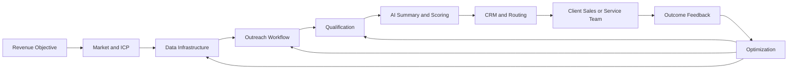
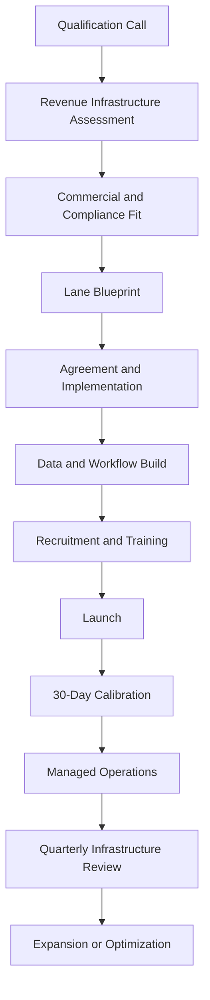

# Omnikom Revenue Infrastructure
## Document 01 — Product Vision, Business Architecture, Commercial Model, and Operating System

**Prepared for:** Omnikom leadership, product, design, engineering, sales, operations, and strategic partners  
**Primary use:** Source-of-truth business specification for the Omnikom website and future platform development  
**Version:** 1.0  
**Status:** Developer-ready strategic architecture  
**Brand position:** Revenue Infrastructure  
**Core product:** Managed Revenue Acquisition Lanes  

---

# 0. How to Use This Document

This document defines the business Omnikom is building. It is not merely marketing copy.

It should guide:

- Website architecture
- Product naming
- Service packaging
- Sales enablement
- CRM design
- Client onboarding
- Operating procedures
- Strategic partnerships
- Industry expansion
- Future software development
- Reporting and analytics
- Commercial proposals

The website must not invent a different business model from the one defined here.

## 0.1 Source-of-Truth Hierarchy

When language conflicts, use the following hierarchy:

1. **Category:** Revenue Infrastructure
2. **Core deployment unit:** Revenue Acquisition Lane
3. **Commercial model:** Recurring infrastructure fee plus implementation, expansion, and optional performance alignment
4. **Client output:** Qualified revenue opportunities and managed acquisition capacity
5. **Operating model:** Omnikom owns the infrastructure; the client owns sales conversion, regulated activity, fulfillment, and closing
6. **Industry strategy:** One shared platform, configured through industry-specific operating models
7. **Partnership strategy:** Omnikom remains the platform and category owner; strategic partners extend vertical expertise, distribution, recruiting, or delivery

## 0.2 Superseded Language

The following language may still be used internally to explain capacity, but it should not lead public positioning:

- VA packages
- Caller packages
- Appointment-setter packages
- Lead-generation packages
- Cold-calling services
- Basic call-center services
- Hourly outsourcing
- Pods as the primary public product

Legacy pod economics remain useful as internal production units. Publicly, the customer buys a **Revenue Lane**, not a caller pod.

---

# 1. Executive Summary

Omnikom is a multi-industry Revenue Infrastructure company.

The company designs, deploys, and operates the systems that turn target markets, existing databases, and commercial opportunities into qualified revenue conversations.

Omnikom combines:

- Market and ICP strategy
- Data sourcing and enrichment
- Outbound execution
- Database reactivation
- Qualification
- Appointment coordination
- CRM delivery
- Opportunity routing
- AI-generated summaries
- Workflow automation
- Quality assurance
- Performance reporting
- Follow-up and nurture
- Global workforce deployment
- Continuous optimization

Omnikom is not positioned as a staffing company, call center, lead vendor, marketing agency, or software-only platform.

Those categories describe individual components. Omnikom operates the full system.

The business should be understood as:

> **The Revenue Infrastructure layer behind companies that need predictable, measurable, and scalable opportunity flow.**

## 1.1 The Core Commercial Thesis

Most companies do not fail because they lack one caller, one CRM, one data source, or one marketing campaign.

They fail because their acquisition system is fragmented.

They assemble growth from:

- Internal hires
- Contractors
- Outsourcing vendors
- List providers
- Dialers
- CRMs
- Automation tools
- Reporting spreadsheets
- Managers
- Trainers
- Quality assurance
- Follow-up teams

Every component can work independently while the system still fails collectively.

Omnikom replaces this fragmented stack with one accountable operating layer.

## 1.2 The Product

The core product is a **Revenue Acquisition Lane**.

A Revenue Acquisition Lane is a managed operating system built around one commercial objective.

Examples:

- Acquire off-market property sellers
- Book roofing inspections
- Recover declined automotive services
- Generate employer meetings for a staffing firm
- Reactivate dormant patients for a dental group
- Book policy reviews for an insurance agency
- Generate qualified decision-maker meetings for a B2B company
- Build a financial-services client onboarding team

Each lane is configured around:

- One objective
- One or more ICPs
- Defined markets or territories
- A data model
- Outreach workflows
- Qualification standards
- Routing rules
- Client response SLAs
- Reporting standards
- Optimization cycles

## 1.3 The Long-Term Model

Omnikom should evolve from managed infrastructure into an integrated platform with four connected layers:

1. **Managed Revenue Infrastructure** — current and near-term core
2. **Industry Operating Modules** — vertical-specific lane designs and workflows
3. **Revenue Intelligence Software** — dashboards, AI, routing, QA, and workflow tools
4. **Partner Ecosystem** — strategic industry, distribution, recruiting, data, integration, and delivery partners

The managed service creates cash flow, proof, operating data, and workflow knowledge.

The software and partner layers create scale, retention, and valuation.

---

# 2. Category Architecture

## 2.1 Category Name

# Revenue Infrastructure

Optional long-form category:

**Managed Outbound Revenue Infrastructure**

Optional technical category:

**Revenue Acquisition Infrastructure**

The public site should lead with **Revenue Infrastructure** because it is concise, broad, and extensible.

## 2.2 Category Definition

Revenue Infrastructure is the operating layer that connects a company’s target market to its sales and service organization.

It combines strategy, data, people, technology, qualification, routing, governance, and optimization to create qualified revenue opportunities.

## 2.3 The Category Boundary

Revenue Infrastructure begins before outreach and ends after qualified handoff and feedback.

It includes:

1. Revenue objective
2. Market definition
3. ICP architecture
4. Data acquisition
5. Data enrichment and hygiene
6. Outreach execution
7. Qualification
8. Appointment or next-action coordination
9. CRM record creation
10. Opportunity routing
11. Client-side response SLA
12. Follow-up and re-nurture
13. QA and governance
14. Reporting
15. Conversion feedback
16. Optimization

It does not generally include:

- Final sales negotiation
- Regulated advice
- Binding financial recommendations
- Legal representation
- Licensed brokerage activity unless separately structured
- Field fulfillment
- Contract execution on behalf of the client
- Service delivery
- Final closing responsibility

## 2.4 Category Promise

> Omnikom helps companies create predictable qualified opportunity flow without rebuilding the acquisition function internally.

## 2.5 One-Word Proposition

**Infrastructure**

Everything else explains the type of infrastructure Omnikom provides.

## 2.6 Primary Positioning Lines

Recommended primary line:

> **Revenue Infrastructure for high-growth companies.**

Recommended supporting line:

> Omnikom designs, deploys, and operates the systems behind outbound acquisition, customer reactivation, qualification, routing, and revenue growth.

Alternative lines:

- Build revenue. Not headcount.
- Not callers. Not leads. Revenue Infrastructure.
- One system from target market to qualified opportunity.
- The operating layer behind predictable outbound growth.
- We build the acquisition lane. Your team closes the opportunity.
- Always moving. Always in control.

---

# 3. The Omnikom Platform Model

Omnikom should be organized as a platform of connected infrastructure layers.

## 3.1 Layer 1 — Market and Revenue Strategy

Purpose:

Define what the lane is designed to produce and whether the economics support deployment.

Capabilities:

- Commercial objective definition
- ICP development
- Market and territory selection
- Offer-to-market analysis
- Customer-value analysis
- Sales-capacity assessment
- Qualification architecture
- Campaign sequencing
- Channel selection
- Risk and compliance review

Primary output:

**Revenue Lane Blueprint**

## 3.2 Layer 2 — Data Infrastructure

Purpose:

Create and maintain the data foundation powering the lane.

Capabilities:

- Data sourcing
- List strategy
- First-party database ingestion
- Data cleaning
- Contact enrichment
- Skip tracing where appropriate
- Deduplication
- Segmentation
- Suppression and opt-out handling
- Territory allocation
- Data refresh cycles
- Source attribution

Primary output:

**Prioritized outreach universe**

## 3.3 Layer 3 — Outreach Infrastructure

Purpose:

Operate structured outreach against approved markets and data.

Capabilities:

- Calling operations
- Inbound response
- Database reactivation
- Email or SMS support where lawful and approved
- Script deployment
- Call-window optimization
- Cadence management
- Contact-attempt logic
- Call dispositioning
- Callback management
- No-show recovery

Primary output:

**Qualified conversations and next actions**

## 3.4 Layer 4 — Qualification Infrastructure

Purpose:

Convert conversations into structured, decision-ready opportunities.

Capabilities:

- Industry-specific qualification frameworks
- Motivation and intent assessment
- Need discovery
- Timeline capture
- Decision-authority confirmation
- Budget or economic fit where appropriate
- Service-area and territory validation
- Compliance-safe information capture
- Opportunity scoring
- Disqualification standards
- Replacement review

Primary output:

**Qualified Revenue Opportunity**

## 3.5 Layer 5 — CRM and Routing Infrastructure

Purpose:

Deliver every opportunity into the correct client workflow with context and accountability.

Capabilities:

- CRM field architecture
- Record creation
- Pipeline-stage mapping
- Source tracking
- Ownership assignment
- Geographic routing
- Location routing
- Service-line routing
- Team notifications
- SLA timers
- Follow-up task creation
- Duplicate prevention
- Status synchronization

Primary output:

**Structured, routed opportunity record**

## 3.6 Layer 6 — AI and Automation Infrastructure

Purpose:

Increase speed, consistency, intelligence, and scalability.

Capabilities:

- AI-generated call summaries
- Lead classification
- Intent detection
- Next-action recommendations
- QA assistance
- Automated notifications
- CRM workflow triggers
- Follow-up sequences
- Knowledge-base support
- Conversation categorization
- Sentiment and risk flags where appropriate
- Manager alerts
- Automated reporting

Primary output:

**Operational intelligence and lower management load**

## 3.7 Layer 7 — Quality and Governance Infrastructure

Purpose:

Protect quality, compliance, continuity, and operating standards.

Capabilities:

- QA scorecards
- Call reviews
- Script adherence
- Qualification accuracy checks
- Coaching
- Attendance monitoring
- Production tracking
- Escalation management
- Replacement planning
- SOP management
- Change control
- Client approval records
- Compliance logs

Primary output:

**Repeatable operating standards**

## 3.8 Layer 8 — Revenue Intelligence and Optimization

Purpose:

Turn operating data into better performance and expansion decisions.

Capabilities:

- Contact-rate analysis
- Conversation-rate analysis
- Qualification-rate analysis
- Show-rate tracking
- Client acceptance tracking
- Speed-to-lead measurement
- Pipeline conversion feedback
- Market comparisons
- Script comparisons
- Data-source comparisons
- Lane economics
- Capacity planning
- Expansion recommendations

Primary output:

**A smarter lane every operating cycle**

## 3.9 Layer 9 — Workforce Infrastructure

Purpose:

Recruit, deploy, manage, and continuously support the human capacity inside each lane.

Capabilities:

- Role design
- Global recruiting
- Screening
- Communication assessment
- Technical assessment
- Training
- Deployment
- Team leadership
- Performance management
- Replacement coverage
- Continuity planning
- Multi-time-zone staffing

Primary output:

**Managed operating capacity, not unmanaged headcount**

---

# 4. Revenue Lane Architecture

## 4.1 Definition

A Revenue Lane is the smallest complete commercial deployment Omnikom operates.

It must have:

- A defined objective
- A measurable audience
- An approved data source
- A clear qualification framework
- A delivery destination
- An accountable client owner
- An agreed response SLA
- A reporting cadence
- A minimum calibration period

## 4.2 Revenue Lane Anatomy

## 4.3 Lane Types

### A. New Customer Acquisition Lane

Designed to identify and qualify new prospects.

Examples:

- Property sellers
- Roofing inspection opportunities
- B2B meetings
- Insurance reviews
- Employer demand

### B. Customer Reactivation Lane

Designed to recover value from existing databases.

Examples:

- Declined automotive repairs
- Dormant patients
- Past estimates
- Lapsed customers
- Closed-lost B2B opportunities
- Expired renewals

### C. Speed-to-Lead Lane

Designed to respond quickly to new inbound demand.

Examples:

- Website inquiries
- Paid lead forms
- Marketplace leads
- Referral inquiries
- Event registrations

### D. Nurture and Recovery Lane

Designed to manage opportunities that are not ready immediately.

Examples:

- Callbacks
- No-shows
- Future-timeline prospects
- Incomplete applications
- Unresponsive leads

### E. Retention and Expansion Lane

Designed to create additional value from existing clients.

Examples:

- Renewals
- Cross-sell
- Upsell
- Policy reviews
- Maintenance agreements
- Membership conversion

### F. Multi-Market Expansion Lane

Designed to launch or compare regions, territories, offices, or locations.

### G. White-Label Revenue Lane

Designed for agencies, consulting firms, platforms, franchisors, brokerages, and strategic partners that want Omnikom infrastructure behind their brand.

### H. Managed Department Lane

Designed to operate a full business function rather than a narrow campaign.

Examples:

- Client onboarding department
- Revenue operations department
- Customer support department
- Lead management department
- Back-office administration department

---

# 5. Revenue Lane Maturity Model

Omnikom should sell maturity and operating capacity, not labor counts.

## 5.1 Stage 1 — Validation Lane

Purpose:

Prove one outbound or reactivation thesis.

Typical scope:

- One primary ICP
- One market or territory
- One offer
- Shared infrastructure
- Standard CRM delivery
- Weekly reporting
- 90-day minimum calibration period

Internal recommended recurring range:

**From $2,250 per month**

Best fit:

- Companies testing outbound
- New market entry
- New service launch
- Early proof before scale

## 5.2 Stage 2 — Growth Lane

Purpose:

Create consistent weekly opportunity flow around a proven offer.

Typical scope:

- One or two ICPs
- One core market or controlled territory set
- Priority operating capacity
- Stronger QA
- Weekly optimization
- Follow-up and nurture
- Enhanced reporting

Internal recommended recurring range:

**From $5,500 per month**

This should become the flagship commercial offer.

## 5.3 Stage 3 — Expansion Infrastructure

Purpose:

Operate multiple markets, service lines, ICPs, locations, or acquisition motions.

Typical scope:

- Multiple lanes
- Semi-dedicated team
- Advanced routing
- Customized dashboards
- Market comparisons
- Reactivation plus acquisition
- Strategic account management

Internal recommended recurring range:

**From $10,000 per month**

Additional lanes:

**Typically $2,500–$7,500 per month**, depending on complexity and shared infrastructure.

## 5.4 Stage 4 — Enterprise Revenue Infrastructure

Purpose:

Become embedded across teams, territories, business units, or portfolio companies.

Typical scope:

- Dedicated or near-dedicated operating capacity
- Multiple revenue lanes
- Governance and SLAs
- Executive reporting
- Territory management
- White-label capability
- Custom integrations
- Multi-country workforce
- Advanced compliance controls

Internal recommended recurring range:

**$18,000–$30,000+ per month**

Implementation:

**$10,000–$25,000+**, based on integration, complexity, data, and deployment requirements.

## 5.5 Commercial Rule

The public website should not publish fixed pricing.

Pricing is determined after evaluating:

- Customer value
- Gross margin
- Sales cycle
- Qualification complexity
- Data difficulty
- Contact difficulty
- Market size
- Compliance burden
- Number of lanes
- Number of locations
- Integration complexity
- Management requirements

---

# 6. Commercial Model

## 6.1 Revenue Streams

### 1. Recurring Infrastructure Fee

The primary revenue stream.

It pays for the operating system, not only the people.

### 2. Implementation and Architecture Fee

Charged for:

- Revenue assessment
- Lane blueprint
- Data architecture
- CRM configuration
- Workflow setup
- Script development
- Reporting setup
- Training and launch
- Custom integrations

### 3. Additional Lane Fees

Expansion into:

- New markets
- New ICPs
- New service lines
- New locations
- New databases
- New channels
- New departments

### 4. Enterprise Governance Fee

Charged for:

- Executive reporting
- SLA governance
- Multi-location oversight
- Portfolio coordination
- White-label support
- Custom compliance controls
- Dedicated account leadership

### 5. Optional Performance Alignment

Only where lawful, contractually clear, operationally attributable, and commercially appropriate.

The default mix should remain:

- 70–90% fixed infrastructure fees
- 10–30% performance alignment

Performance alignment should never replace the infrastructure fee.

### 6. Recruitment and Deployment Fees

Used when a client requests talent placement, direct employment, or recruitment-only support outside a managed lane.

### 7. Technology and Integration Fees

Used for custom dashboards, data integrations, CRM work, AI workflow engineering, or dedicated internal tools.

## 6.2 Commercial Models

### Model A — Fixed Infrastructure

Best for predictable managed operations.

### Model B — Infrastructure Plus Milestone Fee

Recommended default where measurable milestones exist.

Examples:

- Held qualified appointment
- Accepted opportunity
- Completed consultation
- Reactivated service visit

### Model C — Infrastructure Plus Revenue Participation

Used selectively where attribution is strong and legal/compliance review permits it.

### Model D — White-Label Infrastructure

Partner owns the client-facing brand. Omnikom owns or co-owns delivery.

### Model E — Enterprise Managed Function

Omnikom operates a full function under SLAs, governance, and executive reporting.

## 6.3 Contract Structure

Recommended minimum terms:

- Validation: 90 days
- Growth: 6 months
- Expansion: 6–12 months
- Enterprise: 12 months

Contracts should define:

- Scope
- Lane objective
- Qualification criteria
- Data responsibilities
- Channels
- Markets
- Service levels
- Client response SLA
- Reporting
- Replacement standards
- Compliance responsibilities
- Outcome exclusions
- Change requests
- Expansion terms
- Termination
- Data ownership
- Confidentiality
- Intellectual property

---

# 7. ICP Architecture

## 7.1 Universal Ideal Client

A strong Omnikom client generally:

- Has a proven offer
- Has meaningful customer value
- Has an existing sales or service team
- Can respond quickly to qualified opportunities
- Has enough market size or database volume
- Understands its basic economics
- Values systems and reporting
- Can commit to calibration
- Uses or will use a CRM
- Wants to reduce dependence on referrals or fragmented vendors

## 7.2 Strong Economic Fit

Omnikom performs best where one closed outcome is valuable enough to support a recurring infrastructure investment.

Strong-fit economics usually include:

- High-ticket services
- Recurring customer value
- Contract value
- Transaction value
- Multi-location value
- High gross profit
- Recoverable dormant demand
- Large existing database

## 7.3 Disqualifying Conditions

A prospect is usually not ready when:

- The offer is unproven
- The client cannot explain customer value
- There is no sales response capacity
- The client refuses CRM usage
- The market is too small
- The client expects guaranteed revenue
- The client wants only the cheapest labor
- The client has no legal basis for outreach
- The client cannot provide compliance approval
- The client cannot fulfill additional demand

## 7.4 Buyer Personas

### Founder / Owner

Wants growth without building another department.

### Chief Revenue Officer

Wants pipeline capacity, attribution, and expansion.

### VP of Sales

Wants qualified opportunities and better handoff.

### COO

Wants operational ownership, consistency, and lower management burden.

### Head of Marketing

Wants conversion of data, leads, events, and campaigns into pipeline.

### Multi-Location Operator

Wants centralized growth infrastructure across locations.

### Private Equity / Portfolio Operator

Wants repeatable acquisition deployment across portfolio companies.

### Strategic Partner

Wants white-label infrastructure or an industry-specific operating partner.

---

# 8. Omnikom Solution Architecture

The public website should organize solutions by business objective rather than by internal roles.

## 8.1 Acquire

Create new qualified opportunities.

Includes:

- Market targeting
- Prospect data
- Outbound execution
- Qualification
- Appointment coordination
- CRM delivery

## 8.2 Reactivate

Recover value from existing databases.

Includes:

- Dormant account segmentation
- Past-lead outreach
- Declined-service recovery
- No-show recovery
- Closed-lost reactivation
- Lapsed-customer campaigns

## 8.3 Qualify

Create structured, decision-ready opportunities.

Includes:

- Qualification frameworks
- Scoring
- Context capture
- Disqualification
- AI summaries
- Next-step definition

## 8.4 Route

Move each opportunity to the right team or location.

Includes:

- CRM creation
- Geographic assignment
- Product routing
- Team ownership
- SLA alerts
- Task creation

## 8.5 Nurture

Convert timing uncertainty into future opportunity.

Includes:

- Callbacks
- Future-date workflows
- Appointment reminders
- No-show recovery
- Multi-touch follow-up

## 8.6 Operate

Run a complete revenue or support function.

Includes:

- Managed departments
- Workforce
- QA
- SOPs
- Team leadership
- Reporting
- Continuity

## 8.7 Automate

Reduce manual work and improve consistency.

Includes:

- AI summaries
- Workflow automation
- Notifications
- Reporting
- Knowledge systems
- Next-action recommendations

## 8.8 Expand

Add capacity without rebuilding.

Includes:

- New markets
- New locations
- New ICPs
- New service lines
- New languages
- New operating hours
- New partner deployments

---

# 9. Industry Operating Models

Omnikom uses one shared infrastructure platform while configuring qualification, data, language, workflows, and compliance by industry.

## 9.1 Real Estate and Property

### Client Types

- Investors
- Wholesalers
- Flippers
- Brokerages
- Real estate teams
- Agents
- Developers
- Funds
- Property managers
- Commercial brokers

### Primary Lanes

- Seller Acquisition Lane
- Listing Opportunity Lane
- Investor Buy-Box Lane
- Database Nurture Lane
- Expired / FSBO Outreach Lane
- Property Management Owner Acquisition Lane
- Commercial Owner Outreach Lane

### Qualified Opportunity

A verified property owner or authorized decision-maker who:

- Has a relevant property
- Is open to discussing a sale, listing, acquisition, or property solution
- Has a documented reason or context
- Has a timeline
- Has pricing expectations when available
- Has condition or occupancy context when relevant
- Agrees to a next step

### Client-Owned Functions

- Brokerage and agency
- Offers
- Negotiation
- Contracts
- Disclosures
- Transaction management
- Closing
- Licensing

### Key KPIs

- Contact rate
- Owner verification rate
- Qualified seller rate
- Appointment rate
- Opportunity acceptance
- Speed to first response
- Contract/listing feedback
- Market-level economics

### Compliance Notes

- DNC and calling-hour workflows
- Real estate licensing boundaries
- No unlicensed advice or representation
- Referral and fee structures reviewed for RESPA and state law

## 9.2 Home Services

### Client Types

- Roofing
- HVAC
- Solar
- Windows and doors
- Plumbing
- Electrical
- Pest control
- Insulation
- Restoration
- Remodeling
- Flooring
- Painting
- Landscaping
- Pool services

### Primary Lanes

- Inspection Lane
- Estimate Lane
- Replacement Lane
- Storm Response Lane
- Maintenance Agreement Lane
- Past Estimate Reactivation Lane
- Multi-Territory Expansion Lane

### Qualified Opportunity

A property owner or decision-maker who:

- Is within the service territory
- Has a relevant property or service need
- Is open to an inspection, estimate, consultation, or service appointment
- Has a documented timing window
- Has decision authority or access to the decision-maker

### Client-Owned Functions

- Site inspection
- Technical diagnosis
- Pricing
- Financing disclosures
- Insurance representations
- Contracting
- Field fulfillment

### Key KPIs

- Contact-to-inspection rate
- Inspection show rate
- Estimate rate
- Sold-job feedback
- Territory efficiency
- Reactivation revenue

## 9.3 Automotive and Fixed Operations

### Client Types

- Auto repair shops
- Tire shops
- Collision centers
- Dealership fixed operations
- Fleet service companies
- Mobile mechanics
- Detailing and car care groups

### Primary Lanes

- Declined Service Recovery Lane
- Deferred Maintenance Lane
- Inactive Customer Reactivation Lane
- Appointment Confirmation Lane
- Recall or Campaign Support Lane
- Fleet Acquisition Lane
- Multi-Location Service Lane

### Qualified Opportunity

A customer or fleet decision-maker who:

- Has a relevant vehicle or fleet
- Has an identified service need or maintenance opportunity
- Is within service range
- Is open to scheduling, receiving an estimate, or speaking with the service team
- Has a documented next step

### Key KPIs

- Reactivation contact rate
- Booked appointment rate
- Show rate
- Recovered repair orders
- Average recovered repair order
- Location-level performance
- Database segment performance

## 9.4 B2B, SaaS, and Professional Services

### Client Types

- SaaS companies
- Agencies
- IT and MSPs
- Consultants
- Accounting firms
- Cybersecurity companies
- Logistics providers
- Commercial contractors
- Industrial suppliers
- Business services

### Primary Lanes

- Decision-Maker Meeting Lane
- Account-Based Outreach Lane
- Market Entry Lane
- Event Follow-Up Lane
- Dormant Pipeline Reactivation Lane
- Channel Partnership Lane
- Enterprise Account Lane

### Qualified Opportunity

A relevant stakeholder who:

- Matches the account profile
- Has decision authority or influence
- Has a relevant problem, initiative, or timing trigger
- Understands the purpose of the meeting
- Agrees to a defined next action

### Key KPIs

- Account coverage
- Contact rate
- Decision-maker rate
- Positive response rate
- Held meeting rate
- Sales acceptance
- Pipeline created
- Opportunity progression

## 9.5 Staffing and Recruiting

### Client Types

- General staffing firms
- Healthcare staffing
- Skilled trades staffing
- Technology recruiting
- Executive search
- RPO providers
- Talent platforms

### Primary Lanes

- Employer Acquisition Lane
- Job-Order Lane
- Dormant Account Reactivation Lane
- Vertical Expansion Lane
- Territory Launch Lane

### Qualified Opportunity

An employer contact who:

- Has hiring authority or direct access to it
- Has an active or upcoming hiring need
- Matches the staffing firm’s specialty
- Has role, volume, or timing context
- Agrees to a business-development next step

## 9.6 Healthcare, Dental, and Cash-Pay Services

### Client Types

- Dental groups
- Implant practices
- Orthodontics
- Med spas
- Plastic surgery
- Hair restoration
- Physical therapy
- Chiropractic
- Fertility clinics
- Weight management

### Primary Lanes

- Patient Reactivation Lane
- Consultation Lane
- Treatment Plan Recovery Lane
- No-Show Recovery Lane
- Membership Lane
- New-Location Launch Lane

### Qualified Opportunity

A patient or inquiry who:

- Has a relevant treatment interest
- Is within the approved service area
- Has a lawful outreach basis
- Is open to a consultation or scheduling conversation
- Has a documented next step

### Compliance Notes

- HIPAA-aware handling where applicable
- No medical advice
- Approved scripts
- Consent and outreach-basis controls
- Minimum necessary information capture

## 9.7 Legal and Professional Services

### Client Types

- Personal injury firms
- Immigration firms
- Family law
- Estate planning
- Tax resolution
- Bankruptcy
- Employment law
- Business law

### Primary Lanes

- Consultation Lane
- Intake Completion Lane
- Past Inquiry Reactivation Lane
- Community Outreach Lane
- B2B Referral Partner Lane

### Qualified Opportunity

A person or business that:

- Matches the approved practice area
- Is within the approved jurisdiction
- Has a basic matter context
- Is open to a consultation
- Meets client-approved intake criteria

### Compliance Notes

- No legal advice
- No representation that a case will be accepted
- Advertising and solicitation review
- Fee-sharing restrictions
- Jurisdiction-specific rules

## 9.8 Financial Services and Insurance

### Client Types

- Wealth-management firms
- Financial advisory organizations
- Mortgage companies
- Insurance agencies and brokerages
- Lending companies
- Fintech companies
- Payments companies
- Accounting and bookkeeping firms
- Tax services
- Real estate finance companies
- Financial education and membership organizations

### Primary Lanes

- Policy Review Lane
- Renewal Lane
- Financial Consultation Lane
- Mortgage Inquiry Lane
- Client Onboarding Lane
- Document Collection Lane
- Database Reactivation Lane
- Customer Support Lane
- Revenue Operations Department

### Qualified Opportunity

A prospect or client who:

- Matches the approved product or service profile
- Is within the approved jurisdiction
- Has a relevant timing trigger or need
- Agrees to speak with properly licensed personnel
- Has only non-regulated preliminary information captured by Omnikom

### Strategic Partnership Architecture

This vertical may be deployed through **Omnikom Financial Services Infrastructure, powered by Rainmaker Wealth Innovation**.

Omnikom contributes:

- Revenue Infrastructure platform
- Egypt-based operations
- Inside-sales systems
- Data and CRM architecture
- AI and workflow engineering
- QA and reporting
- Managed operations

Rainmaker Wealth Innovation contributes:

- Financial-services industry relationships
- Client acquisition and account development
- Philippines recruitment network
- Financial-services talent sourcing
- Workforce deployment support
- Industry-specific operating context

### Brand Hierarchy

Primary platform:

**Omnikom Revenue Infrastructure**

Industry business unit:

**Omnikom Financial Services Infrastructure**

Strategic partner line:

**Powered by Rainmaker Wealth Innovation**

### Partnership Principle

Rainmaker is not presented as a low-cost staffing source.

It is the strategic financial-services and Philippines workforce partner extending the Omnikom platform.

## 9.9 Education and Training

### Client Types

- Trade schools
- Coaching companies
- Bootcamps
- Tutoring businesses
- Language schools
- Career programs
- Continuing education

### Primary Lanes

- Enrollment Lane
- Inquiry Reactivation Lane
- Event Follow-Up Lane
- Consultation Lane
- Student Retention Lane

## 9.10 Commercial and Industrial Services

### Client Types

- Commercial roofing
- Facility maintenance
- Janitorial
- Security
- Construction
- Equipment leasing
- Waste management
- Logistics
- Industrial services
- Commercial solar

### Primary Lanes

- Commercial Opportunity Lane
- Contract Renewal Lane
- Facility Decision-Maker Lane
- Project Opportunity Lane
- Territory Expansion Lane

### Qualified Opportunity

A relevant decision-maker who:

- Matches account and territory requirements
- Has a relevant need, contract cycle, project, or timing trigger
- Is open to a meeting, site review, or proposal discussion
- Agrees to a defined next action

---

# 10. Strategic Partnership Model

## 10.1 Purpose

Partners should extend Omnikom in one or more of five ways:

1. Industry expertise
2. Distribution and client acquisition
3. Recruiting and workforce supply
4. Technology and data
5. Geographic delivery

## 10.2 Partnership Types

### Strategic Industry Partner

Adds vertical credibility, relationships, and operating knowledge.

Example:

Rainmaker Wealth Innovation for financial services.

### White-Label Partner

Sells Omnikom infrastructure under the partner’s brand.

### Channel Partner

Introduces qualified clients under a defined referral model.

### Delivery Partner

Provides approved workforce or geographic capacity under Omnikom standards.

### Technology Partner

Integrates CRM, data, automation, communications, or analytics capabilities.

### Portfolio Partner

Deploys Omnikom across multiple portfolio companies, branches, offices, franchises, or members.

## 10.3 Partner Governance

Every partnership should define:

- Brand hierarchy
- Client ownership
- Sales ownership
- Delivery ownership
- Data ownership
- Quality standards
- Reporting
- Commercial split
- Non-circumvention
- Confidentiality
- Service-level commitments
- Compliance responsibilities
- Escalation
- Termination and transition

## 10.4 Rainmaker Strategic Model

### Public Positioning

> Omnikom Financial Services Infrastructure combines Omnikom’s revenue, operations, AI, and Egypt delivery systems with Rainmaker Wealth Innovation’s financial-services relationships and Philippines talent network.

### Operating Split

| Capability | Omnikom | Rainmaker | Joint |
|---|---:|---:|---:|
| Platform architecture | Primary | Support |  |
| Revenue lane design | Primary | Industry input | Joint approval |
| Egypt recruiting and delivery | Primary |  |  |
| Philippines recruiting and delivery | Support | Primary |  |
| AI and automation | Primary | Industry input |  |
| QA system | Primary | Local execution support | Joint governance |
| Client acquisition | Support | Primary | Joint enterprise pursuits |
| Account management | Platform lead | Relationship support | Joint for strategic accounts |
| Compliance approvals | Client responsibility | Industry context | Joint coordination |

### Partnership Value Proposition

- Two global talent hubs
- One operating standard
- Financial-services-specific workflows
- Unified client management
- AI-enabled productivity
- Flexible time-zone coverage
- Broader recruiting capacity
- Managed departments, not isolated seats

---

# 11. Operating Model

## 11.1 Client Lifecycle

## 11.2 Implementation Phases

### Phase 1 — Assessment

Deliverables:

- Business model summary
- Customer economics
- ICP
- Market
- Sales capacity
- Current-state workflow
- Constraints
- Compliance boundaries

### Phase 2 — Architecture

Deliverables:

- Lane blueprint
- Data model
- Qualification scorecard
- CRM map
- Routing logic
- Reporting plan
- SLA matrix

### Phase 3 — Build

Deliverables:

- Data pipeline
- Scripts
- SOPs
- CRM fields
- Automations
- QA scorecards
- Dashboard
- Training materials

### Phase 4 — Launch

Deliverables:

- Controlled campaign start
- Daily QA
- Rapid script and data feedback
- Client response monitoring
- Issue log

### Phase 5 — Calibration

Focus:

- Contact rates
- Data accuracy
- Message-market fit
- Qualification consistency
- Handoff quality
- Client response behavior

### Phase 6 — Managed Operations

Focus:

- Production
- QA
- Reporting
- Nurture
- Client success
- Optimization

### Phase 7 — Expansion

Options:

- Additional market
- Additional ICP
- Additional location
- Reactivation lane
- New service line
- White-label deployment
- Enterprise governance

## 11.3 Internal Roles

### Revenue Infrastructure Strategist

Owns commercial architecture and client fit.

### Solutions Architect

Maps workflows, CRM, routing, automation, and reporting.

### Account Director

Owns client governance and expansion.

### Operations Manager

Owns production, staffing, service levels, and issue resolution.

### Team Lead

Owns daily execution, coaching, and attendance.

### Revenue Operator / ISA

Conducts outreach, qualification, follow-up, and CRM updates.

### Data Operations Specialist

Owns list preparation, enrichment, segmentation, and hygiene.

### QA Analyst

Reviews conversations and qualification accuracy.

### AI / Automation Engineer

Builds workflows, summaries, dashboards, and integrations.

### Client Success Manager

Owns adoption, feedback, response SLAs, and reporting cadence.

## 11.4 Client Responsibilities

The client owns:

- Offer quality
- Pricing
- Sales execution
- Negotiation
- Regulated advice
- Licensing
- Contracts
- Fulfillment
- Customer experience
- Response speed
- Outcome feedback
- Compliance approval

Omnikom owns:

- Approved data workflows
- Outreach execution
- Qualification
- CRM delivery
- Routing
- QA
- Reporting
- Managed follow-up
- Operating optimization

---

# 12. Service Levels and Guarantees

Omnikom must guarantee what it controls, not client-side outcomes.

## 12.1 Operating Standards Guarantee

Omnikom commits to operating the lane according to the approved scope, outreach plan, qualification framework, reporting cadence, and QA standards.

## 12.2 Qualification Replacement

An opportunity that materially fails the agreed written criteria may be replaced or credited after QA review.

## 12.3 CRM Transparency

Every qualified opportunity should include:

- Source
- Contact information
- Qualification notes
- Status
- Recording or conversation reference where lawful and available
- AI summary where enabled
- Next action
- Assigned owner

## 12.4 No-Show and Recovery Workflow

Where included, Omnikom attempts follow-up and rescheduling within the agreed cadence.

## 12.5 Calibration Commitment

The first 30 days are used to improve data, scripts, timing, qualification, and routing.

The website must not imply that full mature performance begins immediately on day one.

## 12.6 No Revenue Guarantee

Omnikom does not guarantee:

- Revenue
- Profit
- Closed deals
- Signed contracts
- Installed systems
- Patients
- Cases
- Policies
- Commissions
- Transactions

---

# 13. KPI Framework

## 13.1 Company-Level KPIs

### Active Revenue Lanes

Number of live operating lanes.

### Revenue Infrastructure Under Management — RIUM

A composite measure of the infrastructure Omnikom operates.

RIUM may include:

- Active lanes
- Markets
- ICPs
- Locations
- Managed workflows
- Qualified opportunity capacity
- Databases under management

### Lane Expansion Rate

Percentage of clients adding a second lane, market, ICP, or business unit.

### Net Revenue Retention

Recurring revenue retained and expanded from existing clients.

### Gross Margin

Revenue less loaded fulfillment costs.

### Time to Launch

Days from signed agreement to controlled launch.

### Time to First Accepted Opportunity

Days from launch to first client-accepted opportunity.

### Client Response SLA Compliance

Percentage of opportunities handled by the client within agreed time.

### Opportunity Acceptance Rate

Percentage of delivered opportunities accepted after review.

## 13.2 Lane-Level KPIs

- Data validity
- Contact rate
- Conversation rate
- Qualification rate
- Appointment rate
- Held rate
- Opportunity acceptance
- Client response time
- Pipeline progression
- Outcome feedback rate
- Cost per accepted opportunity
- Revenue or pipeline influenced where attributable

## 13.3 Workforce KPIs

- Attendance
- Productive hours
- Contacts
- Conversations
- Qualification accuracy
- QA score
- Script adherence
- CRM completion
- Coaching improvement
- Turnover
- Replacement time

---

# 14. Internal Capacity and Unit Economics

## 14.1 Legacy Production Reference

The earlier operating model used a shift pod as an internal capacity unit:

- Two callers
- Dialer
- Data
- Basic management allocation
- Approximately 30 qualified opportunities per month under favorable conditions
- Raw cost estimate approximately $550 per month

This is not a universal promise and should not be published.

Industry, data, contactability, qualification complexity, sales cycle, compliance, and market conditions materially change output.

## 14.2 Loaded Cost Model

Financial planning should use loaded cost rather than payroll only.

Loaded cost includes:

- Labor
- Recruiting
- Training
- Team leadership
- QA
- Data
- Technology
- CRM operations
- Reporting
- Client success
- Replacement coverage
- Compliance process
- Management
- Service credits

The legacy planning baseline of **$50–$90 per qualified opportunity** may be used only as an internal starting range. Each lane must develop its own observed economics.

## 14.3 Margin Discipline

Recommended targets:

- Validation Lane gross margin: 55%+
- Growth Lane gross margin: 60%+
- Expansion Infrastructure gross margin: 60–70%+
- Enterprise Infrastructure gross margin: 55–70% depending on customization
- Software and automation add-ons: 75%+

## 14.4 Financial Scenario Framework

Do not model growth solely by client count.

Model:

- Number of active lanes
- Average recurring revenue per lane
- Implementation revenue
- Expansion revenue
- Loaded fulfillment cost
- Gross margin
- Retention
- Lane expansion rate
- Sales capacity
- Implementation capacity

Illustrative model:

| Stage | Clients | Avg. Lanes per Client | Active Lanes | Avg. Revenue per Lane | Illustrative MRR |
|---|---:|---:|---:|---:|---:|
| Proof | 10 | 1.1 | 11 | $5,000 | $55,000 |
| Early Scale | 25 | 1.4 | 35 | $6,000 | $210,000 |
| Multi-Vertical | 50 | 1.7 | 85 | $6,500 | $552,500 |
| Platform Scale | 100 | 2.0 | 200 | $7,000 | $1,400,000 |

These figures are planning illustrations, not forecasts or promises.

---

# 15. Go-to-Market Strategy

## 15.1 Beachhead Verticals

Start where Omnikom has operating history, proof, or immediate access.

Priority order:

1. Real estate and property
2. Automotive service and customer reactivation
3. Home services
4. B2B and staffing
5. Financial services through the Rainmaker strategic partnership

## 15.2 Sales Motion

### Step 1 — Problem-Led Content

Teach infrastructure thinking.

Topics:

- Why hiring callers is not an outbound strategy
- Why databases decay
- Why slow response destroys paid lead ROI
- Why companies rebuild the same acquisition department
- Why qualification and routing matter more than volume

### Step 2 — Revenue Infrastructure Assessment

The assessment should diagnose:

- Economics
- Target market
- Existing data
- Sales capacity
- Response process
- CRM readiness
- Compliance
- Operating complexity

### Step 3 — Lane Blueprint

Present a specific operating model, not a generic proposal.

### Step 4 — Validation Deployment

Start with one lane and a defined test period.

### Step 5 — Expansion

Expand by:

- Market
- ICP
- Service line
- Location
- Database
- Department

## 15.3 Account Expansion Playbook

## 15.4 Strategic Distribution

Growth channels:

- Founder-led outbound
- Industry partnerships
- Agency and consultant white-label
- Brokerage and franchise networks
- Private equity and portfolio operators
- CRM and software partnerships
- Case-study content
- Referral partners
- Industry events
- Partner webinars

---

# 16. Product and Technology Roadmap

## 16.1 Phase 1 — Managed Infrastructure Standardization

Build:

- Standard lane blueprint
- Qualification framework library
- CRM schema library
- QA scorecard library
- Reporting dashboard templates
- Industry playbooks
- Data governance standards

## 16.2 Phase 2 — Internal Revenue Operations Console

Build:

- Lane dashboard
- Data-source tracking
- Daily production
- QA review
- Opportunity acceptance
- Client SLA monitoring
- Expansion recommendations

## 16.3 Phase 3 — Client Revenue Intelligence Portal

Build:

- Opportunity feed
- AI summaries
- Recordings or call references
- Performance dashboard
- Market comparison
- Feedback capture
- Sales outcome tracking
- Service requests

## 16.4 Phase 4 — AI Qualification and Next Action

Build:

- Conversation classification
- Intent scoring
- Qualification validation
- Risk flags
- Next-action recommendations
- Follow-up prioritization

## 16.5 Phase 5 — Partner Platform

Build:

- White-label portal
- Partner account hierarchy
- Commercial attribution
- Partner reporting
- Multi-client governance
- Co-branded modules

## 16.6 Phase 6 — Revenue Infrastructure Marketplace

Potential future model:

- Approved data partners
- Industry specialists
- Integration partners
- Delivery partners
- Training modules
- Revenue lane templates

---

# 17. Compliance and Risk Framework

## 17.1 Core Principle

Omnikom operates compliance-oriented workflows, but the client remains responsible for industry-specific legal, licensing, regulatory, and sales compliance.

## 17.2 Minimum Controls

- DNC and suppression handling where applicable
- Approved calling windows
- Opt-out workflows
- Script approval
- No deceptive claims
- Call logging
- QA review
- Minimum necessary data capture
- Access control
- Data retention standards
- Client-approved qualification criteria
- Escalation for regulated questions

## 17.3 Regulated Industry Boundaries

### Financial Services

Omnikom personnel do not provide financial advice, make fiduciary recommendations, bind policies, approve loans, or perform licensed activity unless separately licensed and authorized.

### Legal

Omnikom personnel do not provide legal advice or represent that a matter will be accepted.

### Healthcare

Omnikom personnel do not diagnose, recommend treatment, or disclose protected information outside approved workflows.

### Real Estate

Omnikom personnel do not perform licensed brokerage activity unless specifically structured and supervised.

## 17.4 Performance Fee Review

Performance fees must be reviewed before use in:

- Real estate
- Mortgage
- Insurance
- Financial advisory
- Legal
- Healthcare

The website must not make broad promises about fee structures in regulated sectors.

## 17.5 Data Risk

The system must define:

- Data source
- Permitted use
- Consent or lawful basis where required
- Suppression process
- Client ownership
- Storage
- Access
- Deletion
- Breach escalation

---

# 18. Brand Architecture

## 18.1 Parent Brand

# Omnikom

Category descriptor:

**Revenue Infrastructure**

## 18.2 Platform Lines

- Omnikom Revenue Infrastructure
- Omnikom Data Infrastructure
- Omnikom AI and Automation
- Omnikom Workforce Infrastructure
- Omnikom Revenue Intelligence

These are platform capabilities, not necessarily separate legal entities.

## 18.3 Industry Modules

- Omnikom Real Estate Infrastructure
- Omnikom Home Services Infrastructure
- Omnikom Automotive Revenue Infrastructure
- Omnikom B2B Revenue Infrastructure
- Omnikom Staffing Revenue Infrastructure
- Omnikom Healthcare Revenue Infrastructure
- Omnikom Legal Revenue Infrastructure
- Omnikom Financial Services Infrastructure
- Omnikom Education Revenue Infrastructure
- Omnikom Commercial Services Infrastructure

## 18.4 Partnership Naming

Recommended pattern:

> **Omnikom [Industry] Infrastructure**  
> Powered by [Strategic Partner]

Example:

> **Omnikom Financial Services Infrastructure**  
> Powered by Rainmaker Wealth Innovation

## 18.5 Product Naming

Publicly favor lane language:

- Seller Acquisition Lane
- Inspection Lane
- Customer Reactivation Lane
- Decision-Maker Meeting Lane
- Patient Consultation Lane
- Case Intake Lane
- Policy Review Lane
- Employer Acquisition Lane
- Enrollment Lane
- Commercial Opportunity Lane

Avoid leading with “pod” unless discussing internal capacity.

---

# 19. Decision Rules for the Website Team

The website must communicate the following in the first screen and first 30 seconds:

1. Omnikom is Revenue Infrastructure.
2. Omnikom operates the system, not only software or labor.
3. Clients can start with one lane.
4. The platform serves multiple industries through specialized deployments.
5. Omnikom does not guarantee client-side closing or revenue.
6. The primary conversion is a Revenue Infrastructure Consultation.

The website must not communicate:

- Cheap outsourcing
- Hourly labor
- Generic appointment setting
- Guaranteed revenue
- Unlimited leads
- A marketplace of random freelancers
- An unproven software product pretending to be fully automated

---

# 20. Final Business Model

## Company

**Omnikom**

## Category

**Revenue Infrastructure**

## Core Product

**Managed Revenue Acquisition Lanes**

## Platform Layers

- Strategy
- Data
- Outreach
- Qualification
- CRM and routing
- AI and automation
- QA and governance
- Revenue intelligence
- Workforce

## Industry Strategy

One shared platform. Industry-specific operating models.

## Commercial Model

- Implementation
- Recurring infrastructure fee
- Additional lanes
- Enterprise governance
- Technology and integration
- Optional performance alignment
- Strategic partnership revenue

## Expansion Model

One client expands through:

- More lanes
- More markets
- More ICPs
- More locations
- More workflows
- More business units

## Strategic KPI

**Revenue Infrastructure Under Management**

## Final Positioning

> **Omnikom is the Revenue Infrastructure platform that designs, deploys, and operates the systems behind qualified opportunity flow across industries.**

---

# 21. Leadership Approval Checklist

Before website development begins, leadership should approve:

- [ ] Revenue Infrastructure as the category
- [ ] Revenue Acquisition Lane as the deployment unit
- [ ] No fixed public pricing
- [ ] Validation / Growth / Expansion / Enterprise maturity model
- [ ] Industry module names
- [ ] Rainmaker partnership brand hierarchy
- [ ] Compliance boundaries
- [ ] Primary CTA
- [ ] Public proof points
- [ ] Public client logos
- [ ] Claims and guarantees
- [ ] Data and privacy language
- [ ] CRM and consultation form destination

