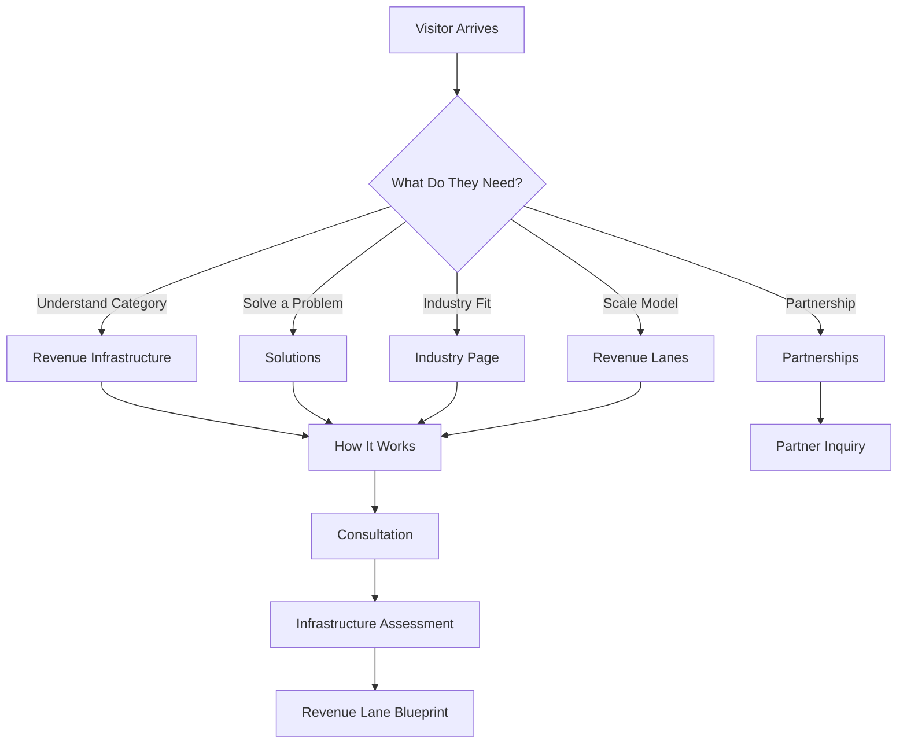

# Omnikom Revenue Infrastructure
## Document 02 — Website UX, Information Architecture, Copywriting, and Customer Journey

**Prepared for:** Omnikom design, development, content, SEO, sales, and leadership teams  
**Primary use:** Complete website build blueprint and page-copy source of truth  
**Version:** 1.0  
**Brand style:** Omnikom — Sharp & Systematic  
**Primary conversion:** Book a Revenue Infrastructure Consultation  

---

# 0. Website Objective

The Omnikom website must introduce a business category, explain a complex operating model clearly, build enterprise trust, and convert qualified companies into consultations.

The site must not look or read like:

- A call-center website
- A VA agency
- A freelance marketplace
- A generic lead-generation agency
- An appointment-setting vendor
- A software product with no operational delivery

The site should feel like an infrastructure platform that combines managed operations, technology, data, AI, workforce, and governance.

## 0.1 Primary Visitor Impression

Within 30 seconds, a visitor should understand:

1. Omnikom is a Revenue Infrastructure company.
2. Omnikom builds and operates acquisition systems.
3. A Revenue Lane connects target data to qualified opportunity.
4. Omnikom serves multiple industries through specialized operating models.
5. The visitor can begin with one lane and expand.
6. Pricing is designed after assessment, not sold as a generic package.

## 0.2 Primary Conversion

**Book a Revenue Infrastructure Consultation**

## 0.3 Secondary Conversions

- Request an Infrastructure Assessment
- Explore Revenue Lanes
- Explore Industry Solutions
- View How It Works
- Download the Revenue Infrastructure Overview
- Discuss a Strategic Partnership
- Read a Case Study

## 0.4 Conversion Principle

The site should educate first, qualify second, and convert third.

Do not force a “buy now” motion.

The product requires diagnosis.

---

# 1. Audience and User Journeys

## 1.1 Founder / Owner Journey

### Entry Questions

- How do I create more opportunities without hiring another internal team?
- Why is our pipeline inconsistent?
- Can this work in my industry?
- What does Omnikom actually operate?

### Recommended Journey

Homepage → Revenue Infrastructure → Industry Page → How It Works → Consultation

### Required Message

> Omnikom gives you acquisition capacity without forcing you to build every operational component internally.

## 1.2 Revenue Leader Journey

### Entry Questions

- How does qualification work?
- How do opportunities enter our CRM?
- Can Omnikom support multiple territories?
- How is performance measured?

### Recommended Journey

Homepage → Platform → Revenue Lanes → Technology → Consultation

### Required Message

> Omnikom connects market strategy, data, outreach, qualification, CRM routing, and reporting inside one governed lane.

## 1.3 Operations Leader Journey

### Entry Questions

- Who manages the team?
- What are the SOPs and SLAs?
- How do QA and escalation work?
- Can Omnikom operate a complete department?

### Recommended Journey

Homepage → How It Works → Managed Operations → Why Omnikom → Consultation

### Required Message

> Omnikom owns the operating system, management structure, QA, reporting, and continuity surrounding the workforce.

## 1.4 Multi-Location Operator Journey

### Entry Questions

- Can one system support all locations?
- Can leads be routed by geography or service?
- Can we compare markets?

### Recommended Journey

Homepage → Expansion Infrastructure → Industry Page → Technology → Consultation

### Required Message

> One Omnikom platform can deploy multiple lanes and route opportunities across locations, markets, and teams.

## 1.5 Strategic Partner Journey

### Entry Questions

- Can I white-label Omnikom?
- Can Omnikom fulfill for my clients?
- Can we build an industry business unit together?

### Recommended Journey

Homepage → Partnerships → White-Label Infrastructure → Contact

### Required Message

> Omnikom can become the infrastructure behind your distribution, client relationships, or industry platform.

## 1.6 Financial Services Visitor Journey

### Entry Questions

- Does Omnikom understand financial-services operations?
- What is Rainmaker’s role?
- Can the partnership recruit and manage across Egypt and the Philippines?

### Recommended Journey

Industry Overview → Financial Services Landing Page → Partnership Architecture → Consultation

### Required Message

> Omnikom Financial Services Infrastructure combines Omnikom’s operating platform with Rainmaker Wealth Innovation’s financial-services relationships and Philippines talent network.

---

# 2. Global Information Architecture

## 2.1 Primary Navigation

- Platform
- Solutions
- Revenue Lanes
- Industries
- How It Works
- Why Omnikom
- Resources
- Company

Primary button:

**Book a Consultation**

## 2.2 Platform Mega Menu

### Revenue Infrastructure

The complete operating system behind acquisition and reactivation.

### Data Infrastructure

Target-market data, enrichment, segmentation, hygiene, and source attribution.

### Outreach Operations

Managed calling, response, follow-up, and reactivation workflows.

### Qualification and Routing

Industry-specific qualification, CRM delivery, scoring, and ownership assignment.

### AI and Automation

Summaries, classification, workflow automation, alerts, and next actions.

### Revenue Intelligence

Performance reporting, QA, market comparisons, and optimization.

### Workforce Infrastructure

Recruitment, training, deployment, management, and continuity.

## 2.3 Solutions Mega Menu

- Acquire New Customers
- Reactivate Existing Databases
- Qualify and Route Opportunities
- Improve Speed-to-Lead
- Nurture and Recover Pipeline
- Operate Managed Departments
- Expand Across Markets
- White-Label Revenue Infrastructure

## 2.4 Revenue Lanes Mega Menu

- Validation Lane
- Growth Lane
- Expansion Infrastructure
- Enterprise Revenue Infrastructure
- Reactivation Lane
- Multi-Market Lane
- Managed Department Lane
- White-Label Lane

Do not show pricing in navigation.

## 2.5 Industries Mega Menu

- Real Estate and Property
- Roofing and Home Services
- HVAC
- Solar
- Automotive
- B2B and SaaS
- Staffing and Recruiting
- Dental and Healthcare
- Med Spa and Aesthetics
- Legal and Professional Services
- Financial Services and Insurance
- Education and Training
- Commercial and Industrial Services

## 2.6 Resources Mega Menu

- Insights
- Revenue Infrastructure Guide
- Industry Playbooks
- Case Studies
- FAQs
- Compliance Principles

## 2.7 Company Mega Menu

- About
- Partnerships
- Careers
- Contact

---

# 3. Complete Sitemap

## Core Pages

1. `/` — Home
2. `/revenue-infrastructure` — Revenue Infrastructure
3. `/platform` — Platform Overview
4. `/data-infrastructure` — Data Infrastructure
5. `/outreach-operations` — Outreach Operations
6. `/qualification-routing` — Qualification and Routing
7. `/ai-automation` — AI and Automation
8. `/revenue-intelligence` — Revenue Intelligence
9. `/workforce-infrastructure` — Workforce Infrastructure
10. `/solutions` — Solutions Overview
11. `/solutions/acquire` — Acquire
12. `/solutions/reactivate` — Reactivate
13. `/solutions/qualify-route` — Qualify and Route
14. `/solutions/speed-to-lead` — Speed-to-Lead
15. `/solutions/nurture-recovery` — Nurture and Recovery
16. `/solutions/managed-departments` — Managed Departments
17. `/solutions/multi-market-expansion` — Multi-Market Expansion
18. `/solutions/white-label` — White-Label Infrastructure
19. `/revenue-lanes` — Revenue Lanes Overview
20. `/revenue-lanes/validation` — Validation Lane
21. `/revenue-lanes/growth` — Growth Lane
22. `/revenue-lanes/expansion` — Expansion Infrastructure
23. `/revenue-lanes/enterprise` — Enterprise Infrastructure
24. `/how-it-works` — Operating Process
25. `/why-omnikom` — Comparison and Differentiation
26. `/industries` — Industries Overview
27. `/about` — About
28. `/partnerships` — Partnerships
29. `/case-studies` — Case Studies
30. `/resources` — Resource Library
31. `/insights` — Blog / Insights
32. `/compliance` — Compliance Principles
33. `/consultation` — Consultation
34. `/contact` — Contact
35. `/careers` — Careers
36. `/privacy` — Privacy
37. `/terms` — Terms
38. `/cookies` — Cookies

## Industry Pages

39. `/industries/real-estate`
40. `/industries/roofing-home-services`
41. `/industries/hvac`
42. `/industries/solar`
43. `/industries/automotive`
44. `/industries/b2b-saas`
45. `/industries/staffing`
46. `/industries/dental-healthcare`
47. `/industries/med-spa`
48. `/industries/legal`
49. `/industries/financial-services`
50. `/industries/education`
51. `/industries/commercial-industrial`

## Partnership Landing Page

52. `/financial-services-infrastructure` — Omnikom Financial Services Infrastructure, powered by Rainmaker Wealth Innovation

## Future Scalable SEO Routes

- `/industries/[industry]/[use-case]`
- `/industries/[industry]/[market]`
- `/solutions/[solution]/[industry]`
- `/case-studies/[slug]`
- `/insights/[slug]`
- `/partners/[slug]`

---

# 4. Global Copy System

## 4.1 Voice

- Direct
- Strategic
- Operational
- Executive
- Clear
- Confident
- Evidence-oriented
- Non-hyped

## 4.2 Preferred Terms

- Revenue Infrastructure
- Revenue Acquisition Lane
- Qualified revenue opportunity
- Opportunity flow
- Data infrastructure
- Qualification framework
- CRM delivery
- Opportunity routing
- Revenue intelligence
- Managed operations
- Revenue capacity
- Infrastructure assessment
- Lane blueprint
- Calibration
- Expansion
- Governance

## 4.3 Avoid as Primary Language

- Cheap labor
- VA packages
- Cold-calling packages
- Leads on demand
- Guaranteed appointments
- Guaranteed revenue
- Unlimited leads
- Call center
- Outsource everything
- Done-for-you sales
- Easy growth
- Explosive growth

## 4.4 CTA Language

Primary:

**Book a Revenue Infrastructure Consultation**

Alternatives:

- Request an Infrastructure Assessment
- Design My Revenue Lane
- Explore the Platform
- View the Operating Model
- Explore Industry Solutions
- Discuss a Strategic Partnership
- Build My Acquisition Lane
- Download the Overview

Avoid:

- Buy now
- Get started free
- Book a demo
- Hire a caller
- Buy leads

---

# 5. Homepage — Complete UX and Copy

## 5.1 Page Metadata

**Title:** Omnikom | Revenue Infrastructure for High-Growth Companies  
**Meta description:** Omnikom designs, deploys, and operates revenue acquisition infrastructure across data, outreach, qualification, CRM routing, AI, workforce, and reporting.  
**Canonical:** `/`  
**H1:** Build revenue. Not headcount.

## 5.2 Navigation State

- Transparent over hero
- Near-black background after scroll
- Logo left
- Menu center
- Lime CTA right
- Sticky after 80px scroll

## 5.3 Hero

### Eyebrow

**revenue infrastructure**

### H1

# build revenue. not headcount.

### Supporting Copy

Omnikom designs, deploys, and operates the systems behind outbound acquisition, customer reactivation, qualification, routing, and revenue growth.

Create predictable qualified opportunity flow without rebuilding the entire acquisition function internally.

### Primary CTA

**Book a Revenue Infrastructure Consultation**

### Secondary CTA

**Explore the Platform**

### Microcopy

Strategy. Data. Outreach. Qualification. CRM. AI. Reporting. One operating system.

### Hero Visual

Animated closed-loop infrastructure system:

```text
Market → Data → Outreach → Qualification → CRM → Sales Team → Outcome → Optimization → Market
```

The Omnikom Q mark should visually represent the loop.

### Optional Trust Line

Built for companies where one qualified opportunity can create meaningful commercial value.

## 5.4 Category Shift Section

### Background

Deep royal blue.

### Eyebrow

**the category shift**

### H2

# outbound should not feel fragmented.

### Body

Most companies assemble outbound growth from disconnected people, software, data vendors, scripts, managers, and reporting systems.

Each piece creates another dependency.

Omnikom replaces the fragmented stack with one managed Revenue Infrastructure layer.

### Comparison Cards

#### assembled outbound

- Multiple vendors
- Separate tools
- Inconsistent quality
- Weak attribution
- High management load

#### internal build

- Recruiting
- Training
- Software
- Leadership
- Replacement
- QA
- Reporting

#### omnikom infrastructure

- One accountable operator
- One qualification standard
- One source of truth
- One expansion model

### CTA

**See How the Infrastructure Works**

## 5.5 Revenue Infrastructure Definition

### H2

# from target market to qualified opportunity.

### Body

Revenue Infrastructure is the complete operating layer behind customer acquisition and reactivation.

It connects market strategy, data, outreach, qualification, CRM delivery, AI, workforce, quality assurance, and reporting.

### Capability Grid

#### market strategy

Define the market, ICP, commercial objective, qualification standard, and lane economics.

#### data infrastructure

Source, enrich, clean, segment, and maintain the data powering the lane.

#### outreach operations

Operate approved calling, response, reactivation, and follow-up workflows.

#### qualification

Capture fit, need, intent, authority, timeline, context, and the agreed next action.

#### crm and routing

Deliver every opportunity with structured notes, source, owner, status, and next step.

#### ai and automation

Generate summaries, classifications, alerts, workflow triggers, and recommendations.

#### quality and governance

Monitor accuracy, adherence, attendance, continuity, and operating standards.

#### revenue intelligence

Measure performance, compare markets, capture outcomes, and optimize the lane.

### Pull Quote

> The lane—not the caller—is the product.

## 5.6 Solutions Section

### Eyebrow

**business objectives**

### H2

# infrastructure built around the outcome you need.

### Cards

#### acquire

Create new qualified opportunities from target markets.

Link: Explore Acquisition Infrastructure

#### reactivate

Recover value from dormant customers, past leads, old estimates, and inactive accounts.

Link: Explore Reactivation

#### qualify and route

Turn conversations into structured opportunities delivered to the correct team.

Link: Explore Qualification and Routing

#### improve speed-to-lead

Respond to inbound demand before commercial intent disappears.

Link: Explore Speed-to-Lead

#### nurture and recover

Manage callbacks, no-shows, future-timeline prospects, and incomplete opportunities.

Link: Explore Nurture and Recovery

#### operate departments

Deploy complete revenue, customer-support, onboarding, or back-office functions.

Link: Explore Managed Departments

## 5.7 Revenue Lanes Section

### Background

Deep royal blue.

### Eyebrow

**deployment model**

### H2

# start with one lane. expand into infrastructure.

### Intro

Every Revenue Lane is designed around a clear commercial objective, target audience, operating workflow, qualification framework, and delivery destination.

### Cards

#### validate

Test one market, ICP, service, or commercial thesis with controlled infrastructure.

#### grow

Create consistent weekly opportunity flow around a proven offer.

#### expand

Add markets, locations, ICPs, service lines, and reactivation workflows.

#### enterprise

Operate governed, multi-lane infrastructure across teams, territories, or portfolio companies.

### Supporting Line

Pricing is designed after the business model, market, complexity, and required capacity are understood.

### CTA

**Explore Revenue Lanes**

## 5.8 Industries Section

### H2

# one platform. configured for your industry.

### Body

The infrastructure remains consistent. The data, language, qualification, workflows, economics, and compliance controls change by vertical.

### Industry Cards

#### real estate

Seller acquisition, listing opportunities, investor pipelines, and property-owner outreach.

#### home services

Inspections, estimates, replacements, maintenance, and past-opportunity reactivation.

#### automotive

Declined-service recovery, inactive customer reactivation, fleet outreach, and multi-location service growth.

#### b2b and saas

Decision-maker outreach, account-based campaigns, pipeline development, and market entry.

#### staffing

Employer acquisition, job-order creation, dormant account reactivation, and vertical expansion.

#### healthcare and dental

Patient reactivation, treatment-plan recovery, consultation coordination, and no-show recovery.

#### legal

Approved consultation, intake, and past-inquiry workflows within defined compliance boundaries.

#### financial services

Policy reviews, renewals, client onboarding, document collection, revenue operations, and managed workforce infrastructure.

#### education

Enrollment consultation, inquiry reactivation, event follow-up, and student retention.

#### commercial services

Decision-maker meetings, contract opportunities, facility outreach, and project pipelines.

### CTA

**Explore All Industries**

## 5.9 Operating System Section

### Background

Lime.

### H2

# always moving. always in control.

### Body

Omnikom does not launch generic campaigns.

Every engagement begins with the client’s economics, market, sales process, operating capacity, and compliance boundaries.

### Process

1. Assess
2. Architect
3. Build
4. Launch
5. Calibrate
6. Operate
7. Expand

### CTA

**View the Complete Process**

## 5.10 Technology Section

### H2

# technology inside. operating outcomes outside.

### Body

Omnikom’s AI and automation capabilities are embedded inside each lane to improve speed, consistency, routing, visibility, and management.

The technology is not presented as a separate miracle product.

It makes the infrastructure more reliable.

### Cards

- AI conversation summaries
- Qualification classification
- CRM workflow automation
- Opportunity routing
- QA intelligence
- Performance dashboards
- Next-action recommendations
- Source attribution

### CTA

**Explore AI and Automation**

## 5.11 Ownership Split

### Background

White or lime.

### H2

# clear ownership creates better execution.

### Omnikom Owns

- Lane strategy
- Data workflows
- Outreach operations
- Qualification
- CRM delivery
- Routing
- QA
- Reporting
- Managed follow-up
- Optimization

### Client Owns

- Offer
- Pricing
- Sales response
- Negotiation
- Regulated activity
- Contracts
- Closing
- Fulfillment
- Customer experience
- Outcome feedback

### Bottom Statement

Omnikom creates and manages qualified revenue opportunities. Your team converts them into customers, transactions, contracts, appointments, or accounts.

## 5.12 Why Omnikom Section

### H2

# built as infrastructure. managed as an operating system.

### Four Pillars

#### accountable

One operating partner owns the lane from data to qualified handoff.

#### configurable

Every lane is built around a specific market, ICP, workflow, and qualification standard.

#### scalable

Add markets, locations, service lines, business units, and departments without rebuilding the function.

#### measurable

Every opportunity includes source, activity, context, status, owner, and next action.

### CTA

**Why Companies Choose Omnikom**

## 5.13 Results Philosophy

### H2

# we do not sell promises. we build the system behind performance.

### Body

Omnikom does not guarantee closed revenue, signed contracts, policies, cases, transactions, or commissions.

We commit to the operating standards we control: approved data workflows, execution, qualification, CRM delivery, reporting, quality assurance, recovery, and optimization.

### Outcome Cards

#### operational clarity

One source of truth from market selection to opportunity handoff.

#### repeatable execution

A system that operates beyond individual hires or vendors.

#### scalable capacity

The ability to expand acquisition without rebuilding the function.

## 5.14 Ideal Client Section

### H2

# built for companies ready to operate growth seriously.

### Strong Fit

- Proven offer
- Meaningful customer value
- Sales or service capacity
- CRM readiness
- Clear target market
- Need for predictable opportunity flow
- Willingness to provide outcome feedback
- Commitment to calibration

### Not a Fit

- Unproven offer
- No response capacity
- No legal basis for outreach
- Expectation of guaranteed revenue
- Refusal to use CRM
- Need for the cheapest hourly labor only

## 5.15 Final CTA

### Background

Lime.

### H2

# design the revenue infrastructure behind your next stage of growth.

### Body

Every company has different customer economics, markets, workflows, and operating constraints.

Omnikom designs the lane around the business—not around a generic package.

### Primary CTA

**Book a Revenue Infrastructure Consultation**

### Secondary CTA

**Download the Revenue Infrastructure Overview**

### Microcopy

No fixed public packages. Start with the business model.

---

# 6. Revenue Infrastructure Page

## 6.1 Metadata

**Title:** Revenue Infrastructure | Omnikom  
**Description:** Understand how Omnikom connects strategy, data, outreach, qualification, CRM routing, AI, workforce, and reporting into one managed operating system.  
**H1:** Outbound, built as infrastructure.

## 6.2 Hero

### H1

# outbound, built as infrastructure.

### Copy

Most outbound functions are assembled from labor, software, data, vendors, and disconnected workflows.

Omnikom combines them into one managed operating layer.

### CTA

**Book an Infrastructure Consultation**

## 6.3 Problem Section

### H2

# the problem is not one missing tool.

### Copy

A company can have a CRM, a dialer, a data provider, callers, scripts, and managers—and still have no reliable acquisition system.

The real problem is the absence of infrastructure connecting every component.

### Fragments List

- Data without segmentation
- Outreach without qualification
- Qualification without routing
- CRM without discipline
- Appointments without recovery
- Reporting without attribution
- Teams without governance

## 6.4 Platform Flow

### H2

# one operating system from market to opportunity.

```text
Revenue Objective
→ Market and ICP
→ Data
→ Outreach
→ Qualification
→ AI Summary
→ CRM and Routing
→ Client Team
→ Outcome Feedback
→ Optimization
```

## 6.5 Infrastructure Components

Use nine detailed cards based on Document 01:

- Strategy
- Data
- Outreach
- Qualification
- CRM and routing
- AI and automation
- QA and governance
- Revenue intelligence
- Workforce

## 6.6 Why Infrastructure Wins

### H2

# campaigns restart. infrastructure compounds.

### Copy

Every operating cycle can improve:

- Data quality
- Script performance
- Qualification accuracy
- Client response
- Routing
- market selection
- follow-up
- reporting

The system becomes more informed over time.

## 6.7 CTA

# build your revenue infrastructure.

**Request an Infrastructure Assessment**

---

# 7. Platform Overview Page

## 7.1 Metadata

**Title:** Omnikom Platform | Data, Outreach, AI, Workforce, and Revenue Intelligence  
**Description:** Explore the operating layers that power every Omnikom Revenue Lane.  
**H1:** One platform. Every operating layer.

## 7.2 Hero

# one platform. every operating layer.

Omnikom brings strategy, data, outreach, qualification, CRM, AI, QA, reporting, and workforce into one connected system.

## 7.3 Layer Navigation

Interactive stacked modules:

1. Market Strategy
2. Data Infrastructure
3. Outreach Operations
4. Qualification
5. CRM and Routing
6. AI and Automation
7. QA and Governance
8. Revenue Intelligence
9. Workforce Infrastructure

## 7.4 Platform Principle

### H2

# every layer has one job. the platform makes them work together.

## 7.5 CTA

**Explore Revenue Lanes**

---

# 8. Platform Capability Pages

## 8.1 Data Infrastructure

### Metadata

**Title:** Data Infrastructure | Omnikom  
**H1:** Better opportunity flow starts with better data.

### Hero Copy

Omnikom sources, enriches, cleans, segments, and maintains the data behind each Revenue Lane.

### Sections

- Market universe design
- First-party database ingestion
- Enrichment and validation
- Segmentation and prioritization
- Suppression and data hygiene
- Source attribution
- Refresh cycles

### CTA

**Build a Data-Powered Revenue Lane**

## 8.2 Outreach Operations

### H1

# managed outreach. controlled execution.

### Copy

Omnikom operates approved calling, response, reactivation, and follow-up workflows through trained teams, defined cadences, scripts, and management.

### Sections

- Calling operations
- Inbound response
- Database reactivation
- Contact cadence
- Call windows
- Callbacks
- No-show recovery
- Reporting

### CTA

**Explore Managed Outreach**

## 8.3 Qualification and Routing

### H1

# conversations become valuable when the next action is clear.

### Copy

Omnikom applies industry-specific qualification frameworks, creates structured CRM records, and routes each accepted opportunity to the correct person, location, territory, or workflow.

### Sections

- Qualification architecture
- Opportunity scoring
- Disqualification
- CRM delivery
- Geographic routing
- SLA alerts
- Client acceptance

### CTA

**Design a Qualification Framework**

## 8.4 AI and Automation

### H1

# intelligence embedded inside the operation.

### Copy

Omnikom uses AI and workflow automation to reduce manual work, improve consistency, and surface the next best action.

### Capabilities

- AI summaries
- Classification
- Qualification validation
- Next-action recommendations
- CRM triggers
- Notifications
- QA assistance
- Dashboards

### Boundary Copy

AI supports the operating system. It does not replace accountability, client approval, licensed judgment, or human relationship-building.

### CTA

**Explore AI-Enabled Operations**

## 8.5 Revenue Intelligence

### H1

# see how the lane is operating—not just how many calls were made.

### Copy

Measure data quality, contactability, qualification, handoff, client response, pipeline movement, and expansion opportunities.

### Metrics

- Data validity
- Contact rate
- Conversation rate
- Qualification rate
- Opportunity acceptance
- Speed-to-lead
- Held rate
- Market performance
- Client feedback

### CTA

**See the Revenue Intelligence Model**

## 8.6 Workforce Infrastructure

### H1

# the workforce sits inside the operating system.

### Copy

Omnikom recruits, trains, deploys, manages, measures, and supports the people behind each lane.

The client does not receive unmanaged headcount. The client receives managed operating capacity.

### Sections

- Role design
- Recruiting
- Screening
- Training
- Deployment
- Team leadership
- QA
- Replacement and continuity
- Multi-time-zone operations

### CTA

**Build Managed Operating Capacity**

---

# 9. Solutions Overview Page

## 9.1 Metadata

**Title:** Revenue Infrastructure Solutions | Omnikom  
**Description:** Acquire customers, reactivate databases, qualify opportunities, improve speed-to-lead, operate departments, and expand across markets.  
**H1:** Infrastructure built around the commercial objective.

## 9.2 Hero

# infrastructure built around the commercial objective.

Start with the business outcome. Omnikom designs the data, workflow, workforce, qualification, routing, and reporting around it.

## 9.3 Solution Cards

Use the eight solution categories from Document 01.

---

# 10. Solution Page Copy

## 10.1 Acquire

### Metadata

**Title:** Customer Acquisition Infrastructure | Omnikom  
**H1:** Create qualified opportunities from target markets.

### Hero Copy

Omnikom builds and operates outbound acquisition lanes that identify, contact, qualify, and route new commercial opportunities.

### Best For

- New customer growth
- New market entry
- Territory expansion
- New service lines
- Sales pipeline development

### What Omnikom Operates

- ICP and market design
- Data sourcing
- Outreach
- Qualification
- CRM delivery
- Follow-up
- Reporting

### CTA

**Build an Acquisition Lane**

## 10.2 Reactivate

### H1

# recover value already inside your database.

### Hero Copy

Past customers, old estimates, dormant leads, no-shows, declined services, and closed-lost opportunities often contain the fastest path to near-term revenue.

### Use Cases

- Automotive declined service
- Dental treatment plans
- Home-service estimates
- Dormant B2B opportunities
- Inactive financial-services clients
- Lapsed memberships

### CTA

**Assess My Reactivation Opportunity**

## 10.3 Qualify and Route

### H1

# every opportunity should arrive with context and ownership.

### Copy

Omnikom converts raw conversations into structured, routed opportunities with clear qualification, status, source, owner, and next action.

### CTA

**Design My Qualification and Routing System**

## 10.4 Speed-to-Lead

### H1

# respond while intent is still active.

### Copy

Omnikom can support rapid response, qualification, appointment coordination, and CRM delivery for approved inbound lead sources.

### CTA

**Improve My Speed-to-Lead**

## 10.5 Nurture and Recovery

### H1

# not now does not mean never.

### Copy

Build systematic follow-up around callbacks, no-shows, future-timeline prospects, incomplete applications, and unresponsive opportunities.

### CTA

**Build a Nurture Lane**

## 10.6 Managed Departments

### H1

# deploy a business function—not isolated seats.

### Copy

Omnikom can recruit, train, operate, and govern complete functions with workflows, service levels, reporting, and management.

### Departments

- Revenue operations
- Client onboarding
- Lead management
- Customer support
- Appointment coordination
- Document collection
- Back-office administration
- Data operations

### CTA

**Design a Managed Department**

## 10.7 Multi-Market Expansion

### H1

# enter new markets without rebuilding the engine.

### Copy

Deploy localized data, scripts, qualification, routing, and reporting across territories, locations, franchises, or business units.

### CTA

**Plan a Multi-Market Deployment**

## 10.8 White-Label Infrastructure

### H1

# your brand in front. Omnikom infrastructure behind it.

### Copy

Agencies, consultants, platforms, brokerages, and strategic partners can deliver revenue infrastructure under their own brand or through a co-branded model.

### Partner Benefits

- Faster product launch
- Managed fulfillment
- Industry modules
- Reporting
- QA
- CRM delivery
- Expansion capacity

### CTA

**Discuss a White-Label Partnership**

---

# 11. Revenue Lanes Page

## 11.1 Metadata

**Title:** Revenue Lanes | Omnikom  
**H1:** Every growth objective needs its own lane.

## 11.2 Hero

# every growth objective needs its own lane.

A Revenue Lane is a complete operating system configured around one audience, objective, workflow, qualification framework, and handoff.

## 11.3 Validation Lane

### Page H1

# validate the market before scaling the machine.

### Copy

Use a controlled Revenue Lane to test one market, ICP, service line, or outbound thesis.

### Best For

- First outbound deployment
- New market
- New service
- New audience
- New data source

### Includes

- Lane blueprint
- Shared infrastructure
- Approved data workflow
- Outreach
- Qualification
- CRM delivery
- Weekly reporting
- Calibration

### CTA

**Request a Validation Lane Assessment**

## 11.4 Growth Lane

### H1

# build consistent weekly opportunity flow.

### Copy

The Growth Lane is designed for companies with a proven offer and sales capacity that need a dependable acquisition rhythm.

### Includes

- Priority capacity
- Stronger targeting
- Follow-up and nurture
- Enhanced QA
- Weekly optimization
- Revenue intelligence

### CTA

**Design a Growth Lane**

## 11.5 Expansion Infrastructure

### H1

# add markets, ICPs, locations, and service lines without rebuilding.

### Copy

Expansion Infrastructure connects multiple lanes through shared data, governance, CRM, routing, and reporting.

### CTA

**Plan My Expansion Infrastructure**

## 11.6 Enterprise Revenue Infrastructure

### H1

# governed revenue infrastructure across the organization.

### Copy

Designed for multi-market, multi-location, portfolio, franchise, and enterprise operating environments.

### Includes

- Dedicated architecture
- Multiple lanes
- Executive reporting
- SLAs
- Custom routing
- White-label capability
- Integrations
- Governance

### CTA

**Discuss an Enterprise Deployment**

---

# 12. How It Works Page

## 12.1 Metadata

**Title:** How Omnikom Works | Revenue Infrastructure Deployment  
**H1:** From commercial objective to operating system.

## 12.2 Hero

# from commercial objective to operating system.

Omnikom assesses the business, architects the lane, builds the workflow, launches controlled operations, calibrates performance, and expands what works.

## 12.3 Step 1 — Assess

### Headline

# understand the economics before building the lane.

### Inputs

- Average customer value
- Gross margin
- Close rate
- Sales capacity
- Target market
- Existing data
- CRM
- Compliance constraints
- Current acquisition channels

### Output

**Revenue Infrastructure Assessment**

## 12.4 Step 2 — Architect

### Inputs

- Objective
- ICP
- Market
- Data model
- Qualification
- Routing
- SLA
- Reporting

### Output

**Revenue Lane Blueprint**

## 12.5 Step 3 — Build

### Deliverables

- Data pipeline
- Scripts
- CRM fields
- Routing rules
- AI prompts
- QA scorecards
- Reporting dashboard
- SOPs

## 12.6 Step 4 — Launch

### Copy

Start with controlled volume, daily QA, rapid feedback, and close client coordination.

## 12.7 Step 5 — Calibrate

### Copy

Improve data accuracy, contact windows, messaging, qualification, handoff, and client response.

## 12.8 Step 6 — Operate

### Copy

Run daily production, QA, reporting, nurture, client success, and continuous optimization.

## 12.9 Step 7 — Expand

### Copy

Add markets, ICPs, locations, service lines, databases, and departments once the lane proves operational fit.

## 12.10 CTA

**Start with an Infrastructure Assessment**

---

# 13. Why Omnikom Page

## 13.1 Metadata

**Title:** Why Omnikom | Infrastructure Instead of Fragmented Outbound  
**H1:** The difference is the system.

## 13.2 Hero

# the difference is the system.

Omnikom does not sell one disconnected component. It operates the complete lane.

## 13.3 Comparison Matrix

| Model | What It Sells | What the Client Still Manages |
|---|---|---|
| Freelancer / VA | Labor | Data, scripts, training, QA, CRM, reporting |
| Call center | Hours and headcount | Strategy, qualification, routing, conversion feedback |
| Lead vendor | Contact records | Follow-up, duplicates, qualification, attribution |
| Software | Tools | All execution and management |
| Traditional agency | Campaign activity | Operational handoff and internal follow-through |
| Omnikom | Revenue Infrastructure | Sales conversion, regulated activity, and fulfillment |

## 13.4 Differentiators

- Infrastructure-first model
- One system from data to handoff
- Industry-specific qualification
- Proprietary AI and workflow engineering
- Global workforce infrastructure
- Source attribution
- Modular expansion
- White-label capability
- Multi-market governance

## 13.5 CTA

**See Whether Omnikom Fits Your Growth Model**

---

# 14. Industries Overview Page

## 14.1 Metadata

**Title:** Industries | Omnikom Revenue Infrastructure  
**H1:** One platform. Configured for your industry.

## 14.2 Hero

# one platform. configured for your industry.

Omnikom adapts each Revenue Lane to the market economics, customer journey, qualification criteria, workflow, and compliance environment of the industry.

## 14.3 Industry Card Template

Each card includes:

- Industry name
- One-line commercial problem
- Primary lane types
- Link

## 14.4 CTA

**Find Your Industry Infrastructure**

---

# 15. Industry Page Template

Every industry page must include:

1. Industry-specific hero
2. Commercial problem
3. Primary Revenue Lanes
4. Use cases
5. Qualified opportunity definition
6. Infrastructure components
7. Client responsibilities
8. Operating process
9. KPIs
10. Compliance boundary
11. CTA

---

# 16. Industry Page Copy

## 16.1 Real Estate and Property

### Metadata

**Title:** Real Estate Seller Acquisition Infrastructure | Omnikom  
**Description:** Managed seller acquisition, listing opportunity, investor pipeline, nurture, and CRM infrastructure for serious real estate operators.  
**H1:** Seller acquisition infrastructure for serious real estate operators.

### Hero Copy

Omnikom builds and operates outbound seller acquisition lanes for investors, brokerages, agents, wholesalers, developers, funds, and property teams.

### Problem

The market does not need more duplicated lead lists.

Operators need proprietary outreach, disciplined qualification, structured follow-up, and clear source attribution.

### Revenue Lanes

- Seller Acquisition
- Listing Opportunities
- Investor Buy-Box
- Expired and FSBO
- Property Management Owner Acquisition
- Commercial Owner Outreach
- Nurture and Recovery

### Qualified Opportunity

A verified owner or authorized decision-maker with a relevant property, an openness to discuss options, documented context, a timeline, and an agreed next step.

### Omnikom Operates

- Market and list strategy
- Data and enrichment
- Outbound execution
- Qualification
- CRM delivery
- AI summaries
- Nurture
- Reporting

### Client Owns

- Brokerage
- Offers
- Negotiation
- Contracts
- Disclosures
- Closing
- Licensed activity

### CTA

**Build a Seller Acquisition Lane**

## 16.2 Roofing and Home Services

### Metadata

**Title:** Roofing and Home Services Revenue Infrastructure | Omnikom  
**H1:** Predictable inspection and estimate opportunities without rebuilding the outbound team.

### Hero Copy

Omnikom builds managed acquisition and reactivation lanes for roofing contractors and high-value home-service operators.

### Revenue Lanes

- Residential Inspection
- Commercial Roofing
- Storm Restoration
- Past Estimate Reactivation
- Maintenance Agreements
- Territory Expansion

### Qualified Opportunity

A property decision-maker in the approved service territory who has a relevant need and is open to an inspection, estimate, consultation, or service conversation.

### CTA

**Build a Roofing or Home Services Lane**

## 16.3 HVAC

### Metadata

**Title:** HVAC Revenue Infrastructure | Omnikom  
**H1:** Build consistent replacement, maintenance, and service opportunity flow.

### Revenue Lanes

- Replacement
- Preventive Maintenance
- Commercial Maintenance
- Seasonal Campaign
- Lapsed Customer Reactivation
- Multi-Location Growth

### CTA

**Build an HVAC Revenue Lane**

## 16.4 Solar

### Metadata

**Title:** Solar Acquisition Infrastructure | Omnikom  
**H1:** Solar consultation infrastructure built around qualification.

### Revenue Lanes

- Residential Consultation
- Commercial Solar
- Battery Storage
- Past Lead Reactivation
- Market Expansion

### Boundary

Omnikom captures approved preliminary information and routes opportunities to appropriately licensed or authorized client personnel.

### CTA

**Build a Solar Acquisition Lane**

## 16.5 Automotive

### Metadata

**Title:** Automotive Customer Reactivation Infrastructure | Omnikom  
**H1:** Recover revenue already inside your customer database.

### Hero Copy

Omnikom helps repair groups, tire shops, collision centers, dealerships, and service networks reactivate customers and create new service opportunities.

### Revenue Lanes

- Declined Service Recovery
- Deferred Maintenance
- Inactive Customer Reactivation
- Fleet Acquisition
- Appointment Confirmation
- Multi-Location Campaigns

### Qualified Opportunity

A customer or fleet decision-maker with a relevant vehicle or service need who is open to scheduling, receiving an estimate, or speaking with the service team.

### CTA

**Build an Automotive Revenue Lane**

## 16.6 B2B and SaaS

### Metadata

**Title:** B2B Outbound Revenue Infrastructure | Omnikom  
**H1:** Outbound infrastructure for complex B2B growth.

### Revenue Lanes

- Decision-Maker Meetings
- Account-Based Outreach
- Market Entry
- Event Follow-Up
- Closed-Lost Reactivation
- Channel Partnerships

### Qualified Opportunity

A relevant stakeholder at a matching account with a documented problem, initiative, timing signal, and agreed next action.

### CTA

**Build a B2B Revenue Lane**

## 16.7 Staffing and Recruiting

### Metadata

**Title:** Staffing Employer Acquisition Infrastructure | Omnikom  
**H1:** Employer acquisition infrastructure for staffing firms.

### Revenue Lanes

- Employer Acquisition
- Job Orders
- Dormant Account Reactivation
- Vertical Expansion
- Territory Launch

### CTA

**Build a Staffing Revenue Lane**

## 16.8 Dental and Healthcare

### Metadata

**Title:** Dental and Healthcare Patient Reactivation Infrastructure | Omnikom  
**H1:** Patient reactivation and consultation infrastructure built for disciplined follow-up.

### Revenue Lanes

- Implant Consultation
- Treatment Plan Recovery
- Inactive Patient Reactivation
- No-Show Recovery
- Orthodontic Consultation
- New-Location Launch

### Boundary

Omnikom does not diagnose, provide medical advice, or replace licensed clinical personnel.

### CTA

**Build a Patient Reactivation Lane**

## 16.9 Med Spa and Aesthetics

### Metadata

**Title:** Med Spa Consultation and Reactivation Infrastructure | Omnikom  
**H1:** Turn past inquiries and inactive clients into structured consultation opportunities.

### Revenue Lanes

- Past Lead Reactivation
- Membership
- Consultation
- Treatment Follow-Up
- No-Show Recovery

### CTA

**Build a Med Spa Revenue Lane**

## 16.10 Legal

### Metadata

**Title:** Legal Intake Infrastructure | Omnikom  
**H1:** Structured intake and consultation infrastructure for law firms.

### Revenue Lanes

- Consultation
- Intake Completion
- Past Inquiry Follow-Up
- Community Outreach
- B2B Referral Development

### Boundary

Omnikom does not provide legal advice, accept cases, or represent the law firm.

### CTA

**Build a Legal Intake Lane**

## 16.11 Financial Services and Insurance

### Metadata

**Title:** Financial Services Revenue and Operations Infrastructure | Omnikom  
**H1:** Financial operations infrastructure built for capacity, consistency, and control.

### Hero Copy

Omnikom helps financial-services organizations build and operate revenue, client-support, onboarding, and back-office functions through one integrated platform.

### Revenue Lanes

- Policy Review
- Renewal and Retention
- Financial Consultation
- Mortgage Inquiry
- Client Onboarding
- Document Collection
- Database Reactivation
- Customer Support

### Strategic Partner Line

Financial-services deployments may be supported through Omnikom Financial Services Infrastructure, powered by Rainmaker Wealth Innovation.

### Boundary

Regulated advice, product recommendations, fiduciary responsibility, binding, underwriting, lending decisions, and licensed solicitation remain with authorized client personnel.

### CTA

**Explore Financial Services Infrastructure**

## 16.12 Education and Training

### Metadata

**Title:** Education Enrollment Infrastructure | Omnikom  
**H1:** Enrollment and inquiry reactivation infrastructure for education providers.

### Revenue Lanes

- Enrollment Consultation
- Inquiry Reactivation
- Event Follow-Up
- Student Retention
- Program Launch

### CTA

**Build an Enrollment Lane**

## 16.13 Commercial and Industrial Services

### Metadata

**Title:** Commercial Opportunity Infrastructure | Omnikom  
**H1:** Commercial opportunity infrastructure for high-value service providers.

### Revenue Lanes

- Facility Decision-Maker Outreach
- Commercial Project Opportunities
- Contract Renewal
- Territory Expansion
- Account Reactivation

### CTA

**Build a Commercial Opportunity Lane**

---

# 17. Financial Services Partnership Landing Page

## 17.1 URL

`/financial-services-infrastructure`

## 17.2 Metadata

**Title:** Omnikom Financial Services Infrastructure | Powered by Rainmaker Wealth Innovation  
**Description:** Revenue, workforce, AI, client-support, onboarding, and back-office infrastructure for financial-services companies across Egypt and the Philippines.  
**H1:** Build financial operations. Not operational complexity.

## 17.3 Branding Hierarchy

Primary:

**Omnikom Financial Services Infrastructure**

Secondary:

**Powered by Rainmaker Wealth Innovation**

Do not lead with “Omnikom × Rainmaker” as though the page is only a temporary partnership announcement.

The page should feel like an established Omnikom industry business unit strengthened by a strategic partner.

## 17.4 Hero

### Eyebrow

**revenue and operations infrastructure for financial services**

### H1

# build financial operations. not operational complexity.

### Copy

Omnikom Financial Services Infrastructure helps financial organizations recruit, deploy, manage, automate, and scale revenue and operations teams through one integrated platform powered by delivery capabilities across Egypt and the Philippines.

### Primary CTA

**Build My Financial Operations Infrastructure**

### Secondary CTA

**Explore the Operating Model**

### Partner Line

Powered by Rainmaker Wealth Innovation.

## 17.5 Problem Section

### H2

# financial services requires more than outsourced headcount.

### Copy

Financial organizations operate under high expectations for responsiveness, documentation, consistency, customer experience, and compliance.

Building capacity through separate recruiters, staffing vendors, call centers, software tools, trainers, and managers creates operational complexity.

Omnikom and Rainmaker bring those capabilities into one coordinated infrastructure model.

## 17.6 Proposition Section

### H2

# two global talent hubs. one operating standard.

### Egypt — Omnikom

- Revenue operations
- Outbound infrastructure
- AI and automation
- Data and CRM architecture
- QA
- Technology
- Operations management

### Philippines — Rainmaker

- Financial-services recruiting
- Talent sourcing
- Client-service professionals
- Administrative operations
- Workforce deployment
- Relationship development

### Joint Layer

- Client discovery
- Process mapping
- Training
- Deployment
- Performance governance
- Reporting
- Expansion

## 17.7 Infrastructure Modules

### Revenue Operations

- Lead qualification
- Appointment coordination
- CRM administration
- Pipeline support
- Renewal outreach
- Database reactivation
- Client follow-up

### Workforce Infrastructure

- Role design
- Recruitment
- Screening
- Training
- Deployment
- Management
- Replacement
- Continuity

### Business Operations

- Client onboarding
- Customer support
- Document processing
- Application support
- Back-office administration
- Reporting
- Data operations

### AI and Workflow Engineering

- CRM automation
- AI call summaries
- Lead classification
- Workflow routing
- Dashboards
- Knowledge systems
- Notifications
- Reporting automation

### Governance

- SOPs
- KPIs
- QA scorecards
- Attendance monitoring
- Coaching
- Escalation
- Client reporting

## 17.8 Who We Serve

- Wealth management
- Financial advisory
- Mortgage
- Insurance
- Lending
- Fintech
- Payments
- Accounting
- Bookkeeping
- Tax services
- Real estate finance
- Financial education
- Financial marketing organizations

## 17.9 Managed Functions

### Client Onboarding Department

Coordinates approved onboarding tasks, records, schedules, and document collection.

### Revenue Operations Team

Supports qualification, follow-up, CRM discipline, and appointment coordination.

### Customer Support Team

Handles approved service, communication, routing, and escalation workflows.

### Back-Office Operations Team

Supports data, documentation, administration, reporting, and process execution.

### Recruitment and Talent Deployment

Sources and deploys professionals from Egypt, the Philippines, or a blended model.

## 17.10 Operating Process

1. Discovery
2. Process Mapping
3. Role and Workflow Design
4. Talent Selection
5. Training and Deployment
6. Managed Operations
7. QA and Reporting
8. Optimization and Expansion

## 17.11 Why the Partnership Is Different

### H2

# most outsourcing companies sell hours. this model deploys operating systems.

### Copy

The partnership combines talent, management, technology, AI, quality assurance, workflows, and performance reporting.

Clients can begin with one professional, a dedicated team, or a complete managed function.

## 17.12 Compliance Boundary

### Copy

Activities requiring licensing, financial advice, fiduciary responsibility, underwriting, binding, regulated solicitation, or product recommendations remain under the supervision and responsibility of appropriately authorized client personnel.

## 17.13 Final CTA

### H2

# build your financial operations infrastructure.

### Copy

Recruit globally. Operate consistently. Scale intelligently.

### Primary CTA

**Book a Financial Infrastructure Consultation**

### Secondary CTA

**Discuss a Strategic Partnership**

---

# 18. About Page

## 18.1 Metadata

**Title:** About Omnikom | Building Revenue Infrastructure  
**H1:** Built to make growth operate like infrastructure.

## 18.2 Hero

# built to make growth operate like infrastructure.

## 18.3 Story

Omnikom was built after seeing companies repeatedly assemble the same acquisition function from scratch.

They hired people, purchased data, bought software, created scripts, managed vendors, rebuilt teams, and still struggled with inconsistent opportunity flow.

Omnikom was created to replace that fragmentation with one operating system.

## 18.4 Mission

To become the Revenue Infrastructure layer companies use to create, manage, and scale qualified commercial opportunities.

## 18.5 Vision

A future where companies do not rebuild outbound departments every time they enter a market, launch a service, or expand a team.

## 18.6 Values

- Precision
- Accountability
- Momentum
- Transparency
- Systems thinking
- Continuous improvement
- Operational ownership
- Partnership

## 18.7 Founder Section

### Headline

# built by an operator, not assembled as an agency.

### Copy

Ahmed Hany built Omnikom around a simple operating question:

Why should every company rebuild the same acquisition department from scratch?

His work across sales, business development, data, outbound operations, AI workflows, workforce systems, and multi-industry growth shaped Omnikom into an infrastructure-first company.

The founder section should support the company story without turning the page into a personal biography.

## 18.8 CTA

**Explore the Omnikom Platform**

---

# 19. Partnerships Page

## 19.1 Metadata

**Title:** Strategic Partnerships | Omnikom  
**H1:** Infrastructure built to plug into serious operators.

## 19.2 Hero

# infrastructure built to plug into serious operators.

Omnikom partners with industry leaders, agencies, platforms, recruiters, technology providers, portfolio operators, and distribution networks.

## 19.3 Partnership Models

### Strategic Industry Partnership

Create an industry-specific Omnikom infrastructure business unit.

### White Label

Offer Omnikom infrastructure under the partner’s brand.

### Channel Partnership

Introduce qualified clients under a defined commercial model.

### Delivery Partnership

Add approved workforce or geographic capacity under Omnikom standards.

### Technology Partnership

Integrate data, CRM, communication, workflow, or analytics systems.

### Portfolio Deployment

Deploy Revenue Infrastructure across multiple companies, branches, offices, or franchise locations.

## 19.4 Rainmaker Feature

### Headline

# financial-services infrastructure, strengthened by strategic industry partnership.

### Copy

Rainmaker Wealth Innovation extends Omnikom’s Financial Services Infrastructure through industry relationships, Philippines recruitment, and talent deployment capabilities.

### CTA

**Explore the Financial Services Partnership**

## 19.5 Partner Form CTA

**Discuss a Strategic Partnership**

---

# 20. Case Studies Page

## 20.1 Metadata

**Title:** Revenue Infrastructure Case Studies | Omnikom  
**H1:** See the infrastructure behind the outcome.

## 20.2 Case Study Structure

Each case study must contain:

- Client type
- Industry
- Challenge
- Existing system
- Revenue Lane deployed
- Data strategy
- Workflow
- Qualification criteria
- Operational metrics
- Client-side responsibilities
- Business outcome
- Attribution caveat
- Expansion opportunity

## 20.3 Metric Labels

Use:

- Qualified Opportunities
- Opportunity Acceptance
- Appointments Held
- Database Reactivated
- Response Time
- Pipeline Created
- Revenue Influenced
- Locations Supported
- Markets Launched

Avoid presenting unsupported ROI or causal claims.

## 20.4 Empty-State Copy

# proof should explain the system—not only celebrate the result.

New case studies will be added as lane data is verified, client-approved, and attributable.

---

# 21. Resources and Insights

## 21.1 Resource Categories

- Revenue Infrastructure
- Outbound Operations
- Data Strategy
- Qualification
- CRM and Routing
- AI and Automation
- Customer Reactivation
- Multi-Market Expansion
- Industry Playbooks
- Enterprise Growth

## 21.2 Pillar Articles

1. What Is Revenue Infrastructure?
2. Why Hiring Callers Is Not an Outbound Strategy
3. How to Build a Revenue Acquisition Lane
4. Revenue Infrastructure vs. Lead Generation
5. How to Calculate Whether Outbound Fits Your Economics
6. The Revenue Lane Framework
7. How Database Reactivation Creates Revenue
8. How Multi-Location Companies Scale Outbound
9. How to Define a Qualified Opportunity
10. The Role of AI in Revenue Infrastructure
11. How Opportunity Routing Improves Conversion
12. Why CRM Discipline Determines Outbound ROI
13. How to Choose Between Internal SDRs and Managed Infrastructure
14. What a 90-Day Outbound Calibration Period Should Include
15. Revenue Infrastructure for Financial Services

## 21.3 Resource CTA

**Get the Revenue Infrastructure Guide**

---

# 22. Compliance Page

## 22.1 Metadata

**Title:** Compliance Principles | Omnikom  
**H1:** Compliance-aware infrastructure. Clear responsibility boundaries.

## 22.2 Hero Copy

Omnikom designs and operates compliance-oriented workflows, including approved scripts, list hygiene, opt-out handling, call logging, qualification boundaries, CRM documentation, and quality assurance.

Clients remain responsible for legal, regulatory, licensing, product, and sales compliance specific to their business.

## 22.3 Sections

- Approved scripts
- DNC and suppression
- Calling windows
- Opt-out handling
- Data handling
- Recordkeeping
- QA
- Regulated handoff
- Client responsibility

## 22.4 Industry Boundaries

Include concise sections for:

- Financial services
- Insurance
- Mortgage
- Healthcare
- Legal
- Real estate

## 22.5 Disclaimer

Website language must state that compliance information is general and does not constitute legal advice.

---

# 23. Consultation Page

## 23.1 Metadata

**Title:** Book a Revenue Infrastructure Consultation | Omnikom  
**H1:** Design the infrastructure around your business.

## 23.2 Hero Copy

This is not a generic pricing call.

It is a working session to understand your customer economics, market, current acquisition process, sales capacity, data, CRM, and growth objective.

## 23.3 Form Fields

Required:

- First name
- Last name
- Work email
- Phone
- Company
- Website
- Industry
- Role
- Country
- Primary market
- Main growth objective

Qualified fields:

- Annual revenue range
- Average customer or contract value
- Number of locations
- Sales team size
- Existing CRM
- Existing database size
- Current acquisition channels
- Current outbound activity
- Desired launch timing
- Main operational challenge
- Partnership interest
- Additional context

## 23.4 Form Logic

Show conditional fields based on:

- Industry
- Number of locations
- Partnership interest
- Existing outbound
- Financial services selection

## 23.5 Button

**Request Infrastructure Assessment**

## 23.6 Confirmation Copy

Your request has been received.

Our team will review the business model, market, stated objective, and operating requirements before the consultation.

## 23.7 Disqualification Handling

If the submission indicates poor fit, do not show a harsh rejection.

Show:

> Omnikom is designed for companies with an established offer, clear customer value, and capacity to respond to qualified opportunities. Our team will review your submission and recommend the most appropriate next step.

---

# 24. Contact Page

## H1

# start the right conversation.

## Contact Options

- Revenue Infrastructure Consultation
- Strategic Partnership
- Existing Client Support
- Careers
- Media and Speaking
- General Inquiry

## CTA

**Send an Inquiry**

---

# 25. FAQ Library

## What is Revenue Infrastructure?

Revenue Infrastructure is the complete operating layer connecting target markets and existing databases to qualified opportunities, CRM delivery, routing, reporting, and optimization.

## Is Omnikom a lead-generation company?

No. Lead generation is one component. Omnikom operates the broader infrastructure around data, outreach, qualification, routing, follow-up, QA, and reporting.

## Is Omnikom a call center?

No. Callers may operate inside a Revenue Lane, but the product is the managed system surrounding them.

## Does Omnikom guarantee revenue?

No. Omnikom guarantees approved operating standards within its control. The client owns sales conversion, regulated activity, contracts, closing, and fulfillment.

## How long does implementation take?

Timing depends on data, integrations, recruiting, compliance, and complexity. A standard lane may launch in several weeks, while enterprise deployments may require a longer implementation.

## Why is there a calibration period?

The first operating period is used to improve data quality, contact timing, messaging, qualification, handoff, and client response.

## Can Omnikom work inside our CRM?

Yes, subject to system compatibility, access, security, and the agreed scope.

## Can Omnikom support multiple locations?

Yes. Opportunities can be routed by geography, service line, team, location, or business unit.

## Can Omnikom reactivate our existing database?

Yes, when the client has a lawful basis to use the data and the campaign is approved.

## Does Omnikom provide people only?

Recruitment-only support can be available, but the primary model is managed operating capacity and complete Revenue Infrastructure.

## What industries does Omnikom serve?

Omnikom supports real estate, home services, automotive, B2B, staffing, healthcare, legal, financial services, education, commercial services, and other high-value sectors where structured opportunity flow creates meaningful value.

## What is Rainmaker Wealth Innovation’s role?

Rainmaker Wealth Innovation is the strategic financial-services and Philippines workforce partner supporting Omnikom Financial Services Infrastructure.

---

# 26. Footer Copy

## Brand Block

**Omnikom**  
Revenue Infrastructure

Omnikom designs, deploys, and operates the systems behind qualified opportunity flow.

## Footer Columns

### Platform

- Revenue Infrastructure
- Data Infrastructure
- Outreach Operations
- AI and Automation
- Revenue Intelligence
- Workforce Infrastructure

### Solutions

- Acquire
- Reactivate
- Qualify and Route
- Managed Departments
- Multi-Market Expansion
- White Label

### Industries

- Real Estate
- Home Services
- Automotive
- B2B
- Staffing
- Healthcare
- Legal
- Financial Services

### Company

- About
- Partnerships
- Careers
- Contact

### Legal

- Privacy
- Terms
- Cookies
- Compliance

## Footer CTA

**Book a Revenue Infrastructure Consultation**

## Legal Microcopy

Omnikom does not guarantee revenue or client-side sales outcomes. Regulated and licensed activities remain the responsibility of appropriately authorized client personnel.

---

# 27. SEO Requirements

## 27.1 Primary Keyword Themes

- Revenue Infrastructure
- Revenue acquisition infrastructure
- Managed outbound infrastructure
- Outbound revenue operations
- Customer reactivation services
- Qualified opportunity generation
- Managed acquisition system
- Revenue lane

## 27.2 Industry Themes

- Real estate seller acquisition infrastructure
- Roofing appointment and inspection infrastructure
- HVAC customer acquisition
- Automotive customer reactivation
- B2B outbound infrastructure
- Staffing employer acquisition
- Dental patient reactivation
- Legal intake infrastructure
- Financial services operations infrastructure
- Commercial opportunity generation

## 27.3 On-Page Rules

- One H1 per page
- Descriptive H2 hierarchy
- Unique title and description
- Internal links between platform, solution, lane, and industry pages
- FAQ schema where appropriate
- Breadcrumbs
- Canonicals
- Open Graph metadata
- Descriptive image alt text

## 27.4 Structured Data

Implement:

- Organization
- Service
- BreadcrumbList
- FAQPage
- Article
- CaseStudy or CreativeWork where appropriate
- ContactPage

Avoid false rating or review schema.

---

# 28. CMS Content Model

## 28.1 Page

Fields:

- Title
- Slug
- SEO title
- Meta description
- H1
- Eyebrow
- Hero copy
- Primary CTA
- Secondary CTA
- Sections
- FAQs
- Related pages
- Schema type
- Published status

## 28.2 Industry

Fields:

- Industry name
- Slug
- Hero
- Problem
- Client types
- Lane types
- Use cases
- Qualified opportunity
- Omnikom responsibilities
- Client responsibilities
- KPIs
- Compliance boundary
- CTA
- Related case studies
- Related insights

## 28.3 Revenue Lane

Fields:

- Lane name
- Maturity stage
- Objective
- Best-fit clients
- Scope
- Deliverables
- Inputs
- Outputs
- Implementation
- Reporting
- FAQs
- CTA

## 28.4 Case Study

Fields:

- Client or anonymous label
- Industry
- Challenge
- Infrastructure deployed
- Lane
- Workflow
- Metrics
- Outcome
- Attribution note
- Quote
- Expansion

## 28.5 Partner

Fields:

- Name
- Logo
- Partner type
- Industry
- Capabilities
- Brand hierarchy
- Joint proposition
- CTA

---

# 29. Microcopy and System States

## 29.1 Form Error

Please review the highlighted fields and provide the required information.

## 29.2 Form Success

Your Infrastructure Assessment request has been received.

## 29.3 Loading

**Architecting the next step…**

Use the animated Q mark.

## 29.4 No Case Studies

Verified infrastructure stories are being prepared.

## 29.5 No Search Results

No resources matched that search. Try a broader topic or explore the Revenue Infrastructure Guide.

## 29.6 404

### H1

# this lane does not exist.

### Copy

Return to the Omnikom platform and continue forward.

### CTA

**Return Home**

---

# 30. Content Acceptance Criteria

Before launch:

- [ ] Every page has one clear purpose
- [ ] Every page has one primary CTA
- [ ] No page leads with staffing, VAs, callers, or cheap labor
- [ ] No unsupported guarantees
- [ ] No unapproved client results
- [ ] Industry pages define client responsibilities
- [ ] Regulated pages include boundaries
- [ ] Financial-services page uses correct Omnikom / Rainmaker hierarchy
- [ ] All metadata is unique
- [ ] All internal links are implemented
- [ ] All forms route to the CRM
- [ ] All copy uses approved terminology
- [ ] Pricing is not public unless leadership explicitly changes strategy

---

# 31. Final Customer Journey



# 32. Final Website Message

The website should leave the visitor with one clear conclusion:

> Omnikom is not another vendor selling a disconnected growth activity. It is the Revenue Infrastructure platform that connects strategy, data, outreach, qualification, CRM, AI, workforce, reporting, and optimization into one managed operating system.

